# System Design: ORCHESTRATOR

> Repo: `orchestrator` | Python 3.12 + AsyncIO
> Version: 1.0 | February 2026

---

## 1. Overview

Orchestrator เป็นสมองกลางของระบบ Trading Bot ทำหน้าที่:

- ควบคุม **Decision Loop** ทุก 5 นาที (configurable)
- เรียก **Haiku 4.5** เป็น pre-filter (ลด Opus calls 80-85%)
- เรียก **Opus 4.6** วิเคราะห์ตลาดและตัดสินใจเทรด
- เรียก **Perplexity** ค้นหาข่าว/macro events เมื่อจำเป็น
- บังคับ **Risk Gate** (hardcoded rules ที่ AI แก้ไม่ได้)
- ทำ **Self-Reflection** (post-trade + periodic deep) และ update **Playbook**
- บันทึกทุกอย่างลง **Trade Journal** (PostgreSQL)

### Component Diagram

```
┌─────────────────────────────────────────────────────────────────────┐
│                        ORCHESTRATOR                                  │
│                                                                      │
│  ┌────────────┐     ┌──────────────┐     ┌──────────────────┐       │
│  │   main.py  │────▶│ StateMachine │────▶│  PromptBuilder   │       │
│  │ (entry)    │     │              │     │                  │       │
│  └────────────┘     └──────┬───────┘     └────────┬─────────┘       │
│                            │                      │                  │
│              ┌─────────────┼──────────────────────┼──────────┐      │
│              │             │                      │          │      │
│              ▼             ▼                      ▼          ▼      │
│  ┌───────────────┐ ┌─────────────┐ ┌──────────────┐ ┌───────────┐  │
│  │ HaikuScreener │ │ OpusClient  │ │  RiskGate    │ │Perplexity │  │
│  │ (pre-filter)  │ │ (brain)     │ │ (hardcoded)  │ │Client     │  │
│  └───────────────┘ └──────┬──────┘ └──────────────┘ └───────────┘  │
│                           │                                         │
│              ┌────────────┼────────────────┐                        │
│              ▼                             ▼                        │
│  ┌───────────────────┐         ┌───────────────────┐               │
│  │ ReflectionEngine  │         │ PlaybookManager   │               │
│  │ (self-learning)   │────────▶│ (CRUD/versioning) │               │
│  └───────────────────┘         └───────────────────┘               │
│                                                                      │
│  ┌───────────────────┐         ┌───────────────────┐               │
│  │  RedisClient      │         │  DB Repository    │               │
│  │ (pub/sub streams) │         │ (SQLAlchemy async) │               │
│  └───────────────────┘         └───────────────────┘               │
└─────────────────────────────────────────────────────────────────────┘
```

---

## 2. Directory Structure

```
orchestrator/
├── Dockerfile
├── pyproject.toml
├── alembic.ini
├── alembic/
│   └── versions/
│       ├── 001_initial_schema.py        # trades, playbook_versions, reflection_logs, etc.
│       └── 002_add_screener_logs.py     # screener_logs table
├── src/
│   └── orchestrator/
│       ├── __init__.py
│       ├── main.py                      # Entry point, สร้าง event loop, start main_loop
│       ├── config.py                    # Settings (pydantic-settings, อ่านจาก env vars)
│       ├── state_machine.py             # Orchestrator state machine + main loop
│       ├── haiku_screener.py            # Haiku 4.5 pre-filter
│       ├── opus_client.py               # Anthropic AsyncClient wrapper (Opus 4.6)
│       ├── prompt_builder.py            # สร้าง prompt สำหรับ analysis/reflection
│       ├── risk_gate.py                 # Hardcoded circuit breakers
│       ├── reflection_engine.py         # Post-trade + periodic deep reflection
│       ├── playbook_manager.py          # Playbook CRUD & versioning ใน DB
│       ├── perplexity_client.py         # Perplexity sonar-pro API wrapper
│       ├── news_scheduler.py            # ตารางข่าว FOMC/CPI/NFP + trigger logic
│       ├── models/
│       │   ├── __init__.py
│       │   ├── decision.py              # OpusDecision, AnalysisResult
│       │   ├── snapshot.py              # MarketSnapshot, IndicatorSet, Ticker
│       │   ├── trade.py                 # TradeRecord, TradeResult
│       │   ├── playbook.py              # Playbook, StrategyDef, Lesson
│       │   ├── screen_result.py         # ScreenResult
│       │   ├── reflection.py            # TradeReview, DeepReflectionResult
│       │   ├── research.py              # ResearchResult
│       │   └── messages.py              # Redis Stream message schemas (shared protocol)
│       ├── db/
│       │   ├── __init__.py
│       │   ├── engine.py                # create_async_engine, session factory
│       │   ├── models.py                # SQLAlchemy ORM models
│       │   └── repository.py            # TradeRepo, PlaybookRepo, ReflectionRepo
│       └── redis_client.py              # Redis Streams wrapper (publish/consume)
└── tests/
    ├── conftest.py                      # Fixtures (mock Redis, mock DB, mock Anthropic)
    ├── test_risk_gate.py
    ├── test_prompt_builder.py
    ├── test_haiku_screener.py
    ├── test_state_machine.py
    ├── test_playbook_manager.py
    └── test_reflection_engine.py
```

---

## 3. Class Diagrams + Method Signatures

### 3.1 Config (`config.py`)

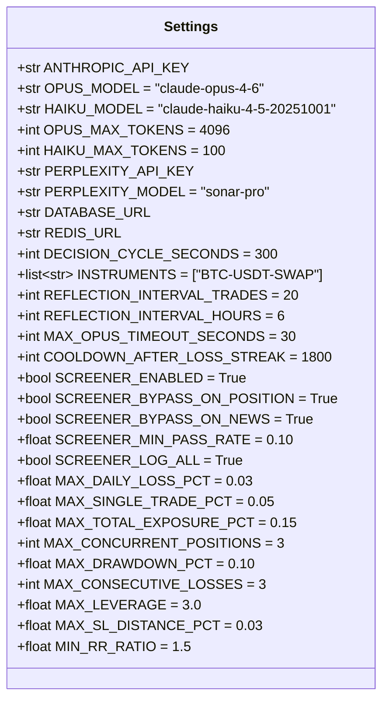

```python
# config.py
from pydantic_settings import BaseSettings

class Settings(BaseSettings):
    # --- Anthropic ---
    ANTHROPIC_API_KEY: str
    OPUS_MODEL: str = "claude-opus-4-6"
    HAIKU_MODEL: str = "claude-haiku-4-5-20251001"
    OPUS_MAX_TOKENS: int = 4096
    HAIKU_MAX_TOKENS: int = 100
    MAX_OPUS_TIMEOUT_SECONDS: int = 30

    # --- Perplexity ---
    PERPLEXITY_API_KEY: str
    PERPLEXITY_MODEL: str = "sonar-pro"

    # --- Infrastructure ---
    DATABASE_URL: str
    REDIS_URL: str = "redis://redis:6379"

    # --- Decision Cycle ---
    DECISION_CYCLE_SECONDS: int = 300
    INSTRUMENTS: list[str] = ["BTC-USDT-SWAP"]
    REFLECTION_INTERVAL_TRADES: int = 20
    REFLECTION_INTERVAL_HOURS: int = 6
    COOLDOWN_AFTER_LOSS_STREAK: int = 1800

    # --- Haiku Screener ---
    SCREENER_ENABLED: bool = True
    SCREENER_BYPASS_ON_POSITION: bool = True
    SCREENER_BYPASS_ON_NEWS: bool = True
    SCREENER_MIN_PASS_RATE: float = 0.10
    SCREENER_LOG_ALL: bool = True

    # --- Risk Gate (Hardcoded) ---
    MAX_DAILY_LOSS_PCT: float = 0.03
    MAX_SINGLE_TRADE_PCT: float = 0.05
    MAX_TOTAL_EXPOSURE_PCT: float = 0.15
    MAX_CONCURRENT_POSITIONS: int = 3
    MAX_DRAWDOWN_PCT: float = 0.10
    MAX_CONSECUTIVE_LOSSES: int = 3
    MAX_LEVERAGE: float = 3.0
    MAX_SL_DISTANCE_PCT: float = 0.03
    MIN_RR_RATIO: float = 1.5

    model_config = {"env_prefix": "", "case_sensitive": True}
```

---

### 3.2 State Machine (`state_machine.py`)

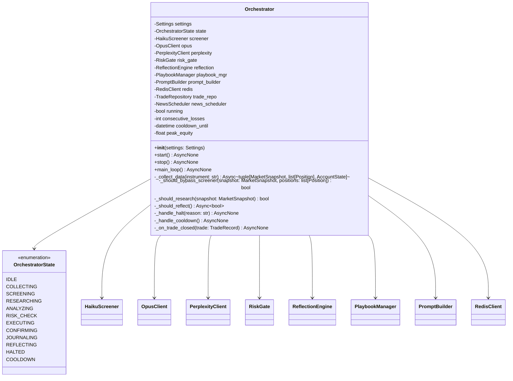

```python
# state_machine.py
import asyncio
import enum
from datetime import datetime, timedelta

class OrchestratorState(enum.Enum):
    IDLE = "idle"
    COLLECTING = "collecting"
    SCREENING = "screening"
    RESEARCHING = "researching"
    ANALYZING = "analyzing"
    RISK_CHECK = "risk_check"
    EXECUTING = "executing"
    CONFIRMING = "confirming"
    JOURNALING = "journaling"
    REFLECTING = "reflecting"
    HALTED = "halted"
    COOLDOWN = "cooldown"

class Orchestrator:
    def __init__(self, settings: Settings) -> None: ...

    async def start(self) -> None:
        """Initialize all components, start Redis subscriptions, run main_loop."""

    async def stop(self) -> None:
        """Graceful shutdown: close connections, flush pending writes."""

    async def main_loop(self) -> None:
        """
        Main decision loop ทำงานทุก DECISION_CYCLE_SECONDS:
        1. COLLECTING  — ดึง snapshot, positions, account จาก Redis
        2. SCREENING   — Haiku pre-filter (ถ้าไม่ bypass)
        3. RESEARCHING  — Perplexity (ถ้าจำเป็น)
        4. ANALYZING   — Opus full analysis
        5. RISK_CHECK  — Risk gate validation
        6. EXECUTING   — ส่ง order ผ่าน Redis trade:orders
        7. CONFIRMING  — รอ fill confirmation จาก trade:fills
        8. JOURNALING  — บันทึกลง DB
        9. REFLECTING  — Self-reflection (ถ้าถึงเงื่อนไข)
        """

    async def _collect_data(
        self, instrument: str
    ) -> tuple[MarketSnapshot, list[Position], AccountState]:
        """อ่าน latest snapshot, positions, account จาก Redis."""

    def _should_bypass_screener(
        self, snapshot: MarketSnapshot, positions: list[Position]
    ) -> bool:
        """
        Return True ถ้าต้อง bypass Haiku ไปเรียก Opus ตรง:
        - มี open position
        - ใกล้ข่าวสำคัญ (news_scheduler)
        - market anomaly (>3% move in 1H)
        - funding rate spike
        """

    def _should_research(self, snapshot: MarketSnapshot) -> bool:
        """
        Return True ถ้าต้องเรียก Perplexity:
        - ก่อน scheduled news 30 นาที
        - ราคาเปลี่ยน > 3% ใน 1 ชม.
        - funding rate > 0.05% หรือ < -0.03%
        - OI เปลี่ยน > 10% ใน 4 ชม.
        """

    async def _should_reflect(self) -> bool:
        """Return True ถ้า trades since last reflection >= 20 หรือ hours >= 6."""

    async def _handle_halt(self, reason: str) -> None:
        """Set state=HALTED, publish system:alerts, log to DB."""

    async def _handle_cooldown(self) -> None:
        """Set state=COOLDOWN, wait COOLDOWN_AFTER_LOSS_STREAK seconds."""

    async def _on_trade_closed(self, trade: TradeRecord) -> None:
        """
        Called เมื่อ position closed:
        1. Update trade record in DB
        2. Run post-trade reflection
        3. Update consecutive_losses counter
        4. Check cooldown trigger
        """
```

---

### 3.3 Haiku Screener (`haiku_screener.py`)

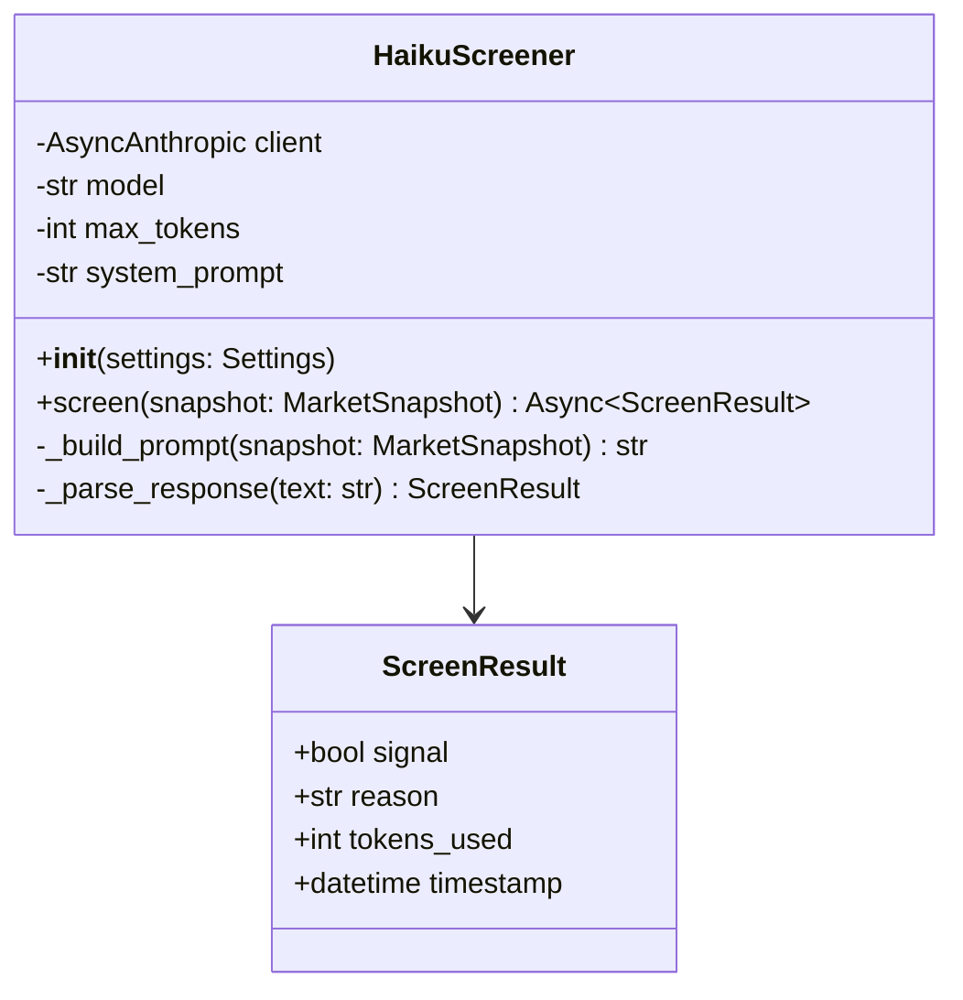

```python
# haiku_screener.py
from anthropic import AsyncAnthropic
from orchestrator.models.snapshot import MarketSnapshot
from orchestrator.models.screen_result import ScreenResult

SCREENER_SYSTEM_PROMPT = """You are a quick crypto market screener.
Given a market snapshot, determine if there's an actionable trading setup RIGHT NOW.
Signal = true ONLY if:
- Clear breakout/breakdown with volume
- RSI extreme (<30 or >70) in ranging market
- Strong trend pullback to EMA support
- Significant divergence between indicators
Signal = false if market is choppy, unclear, or already priced in.
Respond ONLY with JSON: {"signal": true/false, "reason": "..."}"""

class HaikuScreener:
    def __init__(self, settings: Settings) -> None: ...

    async def screen(self, snapshot: MarketSnapshot) -> ScreenResult:
        """
        เรียก Haiku 4.5 ด้วย snapshot สั้นๆ (~500 tokens input, ~30 tokens output)
        Cost per call: ~$0.00065
        Latency: ~200-500ms

        Returns:
            ScreenResult with signal=True ถ้ามี actionable setup
        """

    def _build_prompt(self, snapshot: MarketSnapshot) -> str:
        """
        สร้าง prompt สั้นๆ จาก snapshot:
        - symbol, price, 24h_change
        - RSI_15m, RSI_1H, MACD_15m, MACD_1H
        - regime, ADX, volume_vs_avg
        - funding, OI_change_4h
        - BB_position_15m, EMA_alignment
        """

    def _parse_response(self, text: str) -> ScreenResult:
        """Parse JSON response จาก Haiku → ScreenResult"""
```

---

### 3.4 Opus Client (`opus_client.py`)

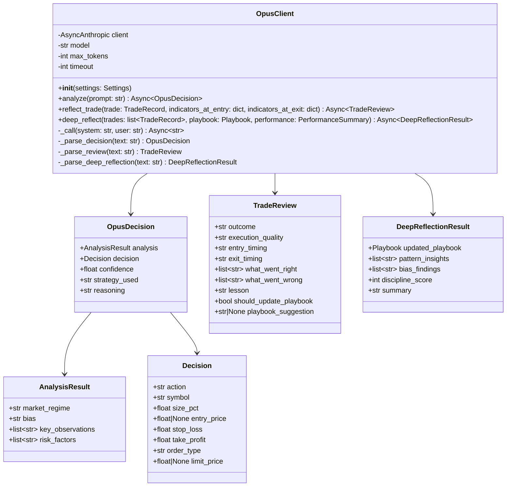

```python
# opus_client.py
from anthropic import AsyncAnthropic

class OpusClient:
    def __init__(self, settings: Settings) -> None: ...

    async def analyze(self, prompt: str) -> OpusDecision:
        """
        ส่ง full analysis prompt ให้ Opus 4.6
        Input: ~3,000 tokens | Output: ~500 tokens
        Cost per call: ~$0.028

        Returns:
            OpusDecision with action (OPEN_LONG/OPEN_SHORT/CLOSE/ADD/REDUCE/HOLD)
        """

    async def reflect_trade(
        self,
        trade: TradeRecord,
        indicators_at_entry: dict,
        indicators_at_exit: dict,
    ) -> TradeReview:
        """
        Post-trade self-reflection
        Input: ~2,000 tokens | Output: ~400 tokens

        Returns:
            TradeReview with lessons learned
        """

    async def deep_reflect(
        self,
        trades: list[TradeRecord],
        playbook: Playbook,
        performance: PerformanceSummary,
    ) -> DeepReflectionResult:
        """
        Periodic deep reflection ทุก 20 trades หรือ 6 ชม.
        Input: ~8,000 tokens | Output: ~2,000 tokens

        Returns:
            DeepReflectionResult with updated Playbook (version incremented)
        """

    async def _call(self, system: str, user: str) -> str:
        """
        Low-level Anthropic API call:
        - model: claude-opus-4-6
        - max_tokens: 4096
        - temperature: 0.2 (low for disciplined decisions)
        - timeout: 30s
        """
```

---

### 3.5 Prompt Builder (`prompt_builder.py`)

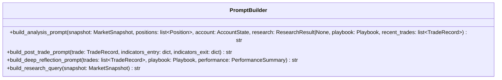

```python
# prompt_builder.py

class PromptBuilder:
    def build_analysis_prompt(
        self,
        snapshot: MarketSnapshot,
        positions: list[Position],
        account: AccountState,
        research: ResearchResult | None,
        playbook: Playbook,
        recent_trades: list[TradeRecord],
    ) -> str:
        """
        สร้าง XML-structured prompt สำหรับ Opus analysis:

        <system>Expert crypto trader instructions</system>
        <market_snapshot>...</market_snapshot>
        <technical_indicators timeframe="15m">...</technical_indicators>
        <technical_indicators timeframe="1H">...</technical_indicators>
        <technical_indicators timeframe="4H">...</technical_indicators>
        <current_positions>...</current_positions>
        <account_state>...</account_state>
        <research_context>...</research_context>  (ถ้ามี)
        <playbook version="N">...</playbook>
        <recent_trades count="10">...</recent_trades>
        <output_format>JSON schema</output_format>
        """

    def build_post_trade_prompt(
        self,
        trade: TradeRecord,
        indicators_entry: dict,
        indicators_exit: dict,
    ) -> str:
        """
        สร้าง prompt สำหรับ post-trade reflection:

        <system>Analyze completed trade honestly</system>
        <completed_trade>...</completed_trade>
        <output_format>JSON review schema</output_format>
        """

    def build_deep_reflection_prompt(
        self,
        trades: list[TradeRecord],
        playbook: Playbook,
        performance: PerformanceSummary,
    ) -> str:
        """
        สร้าง prompt สำหรับ periodic deep reflection:

        <system>Review last N trades for patterns</system>
        <performance_summary>...</performance_summary>
        <breakdown_by_strategy>...</breakdown_by_strategy>
        <breakdown_by_regime>...</breakdown_by_regime>
        <breakdown_by_time>...</breakdown_by_time>
        <confidence_calibration>...</confidence_calibration>
        <individual_trade_reviews>...</individual_trade_reviews>
        <current_playbook>...</current_playbook>
        <tasks>5 analysis tasks + output updated playbook</tasks>
        """

    def build_research_query(self, snapshot: MarketSnapshot) -> str:
        """สร้าง query สำหรับ Perplexity based on market context."""
```

---

### 3.6 Risk Gate (`risk_gate.py`)

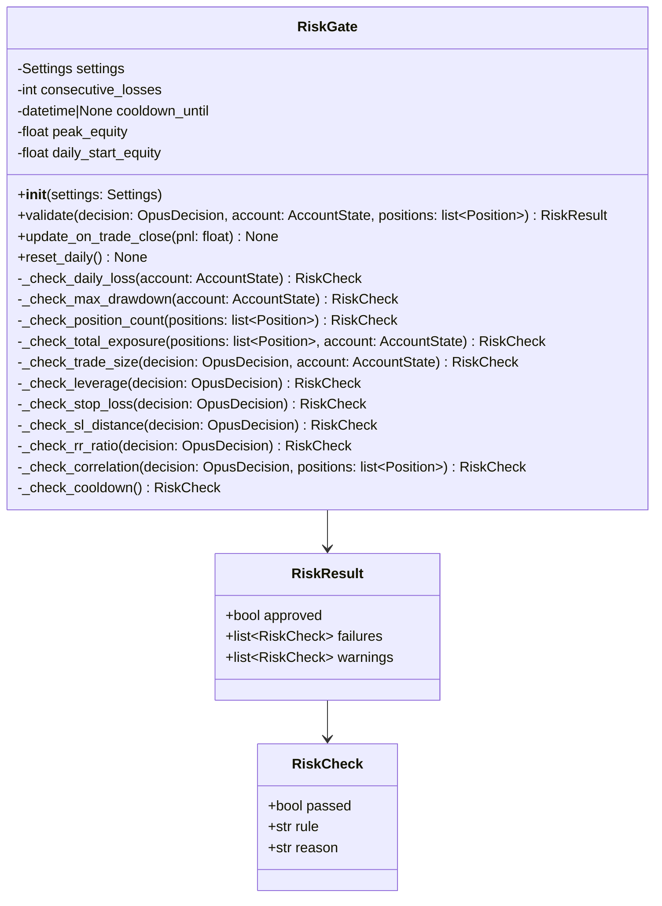

```python
# risk_gate.py

class RiskGate:
    """
    Hardcoded circuit breakers — Opus CANNOT override these rules.

    | Rule                     | Threshold        | Action                       |
    |--------------------------|------------------|------------------------------|
    | Max Daily Loss           | -3% equity       | HALT all trading for the day |
    | Max Single Trade Size    | 5% of equity     | REJECT order                 |
    | Max Total Exposure       | 15% of equity    | REJECT new positions         |
    | Max Concurrent Positions | 3                | REJECT new positions         |
    | Max Drawdown from Peak   | -10% equity      | EMERGENCY HALT + alert       |
    | Consecutive Loss Cooldown| 3 losses         | 30 min cooldown              |
    | Max Leverage             | 3x               | Cap leverage                 |
    | Required Stop Loss       | always           | REJECT without SL            |
    | Max SL Distance          | 3% from entry    | REJECT if SL too far         |
    | Min R:R Ratio            | 1.5:1            | REJECT poor R:R              |
    | Correlated Position Check| r > 0.8          | WARN + reduce size           |
    """

    def __init__(self, settings: Settings) -> None: ...

    def validate(
        self,
        decision: OpusDecision,
        account: AccountState,
        positions: list[Position],
    ) -> RiskResult:
        """
        Run all risk checks sequentially.
        Returns RiskResult with approved=False if ANY check fails.
        Logs all failures to DB.
        """

    def update_on_trade_close(self, pnl: float) -> None:
        """Update consecutive_losses counter, peak_equity tracking."""

    def reset_daily(self) -> None:
        """Reset daily_start_equity at 00:00 UTC."""
```

---

### 3.7 Reflection Engine (`reflection_engine.py`)

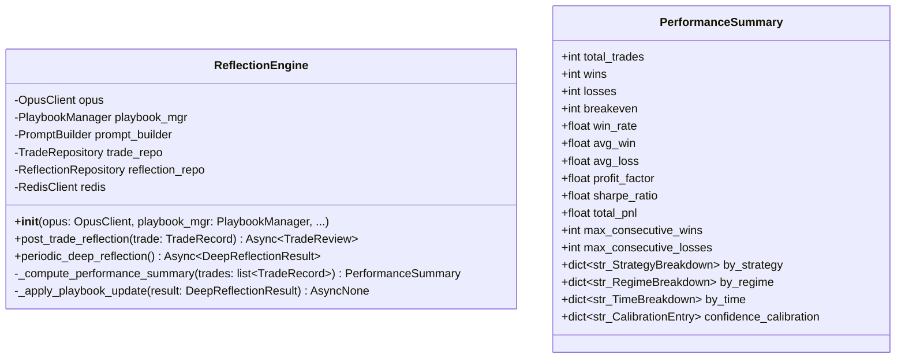

```python
# reflection_engine.py

class ReflectionEngine:
    def __init__(
        self,
        opus: OpusClient,
        playbook_mgr: PlaybookManager,
        prompt_builder: PromptBuilder,
        trade_repo: TradeRepository,
        reflection_repo: ReflectionRepository,
        redis: RedisClient,
    ) -> None: ...

    async def post_trade_reflection(self, trade: TradeRecord) -> TradeReview:
        """
        หลังจบทุกเทรด:
        1. Build post-trade prompt
        2. Call Opus reflect_trade()
        3. Save TradeReview to trade.self_review
        4. Save to reflection_logs table
        5. ถ้า should_update_playbook=True → queue for next deep reflection
        """

    async def periodic_deep_reflection(self) -> DeepReflectionResult:
        """
        ทุก 20 trades หรือ 6 ชม. (whichever first):
        1. Load trades since last reflection
        2. Compute PerformanceSummary (breakdowns by strategy/regime/time)
        3. Build deep reflection prompt
        4. Call Opus deep_reflect()
        5. Apply playbook updates (increment version)
        6. Save to reflection_logs + playbook_versions tables
        7. Publish system:alerts notification
        """

    def _compute_performance_summary(
        self, trades: list[TradeRecord]
    ) -> PerformanceSummary:
        """
        คำนวณ metrics จาก trades:
        - Win rate, profit factor, Sharpe ratio
        - Breakdown by strategy, regime, time-of-day
        - Confidence calibration (stated vs actual)
        """

    async def _apply_playbook_update(
        self, result: DeepReflectionResult
    ) -> None:
        """Save new playbook version to DB, log changes."""
```

---

### 3.8 Playbook Manager (`playbook_manager.py`)

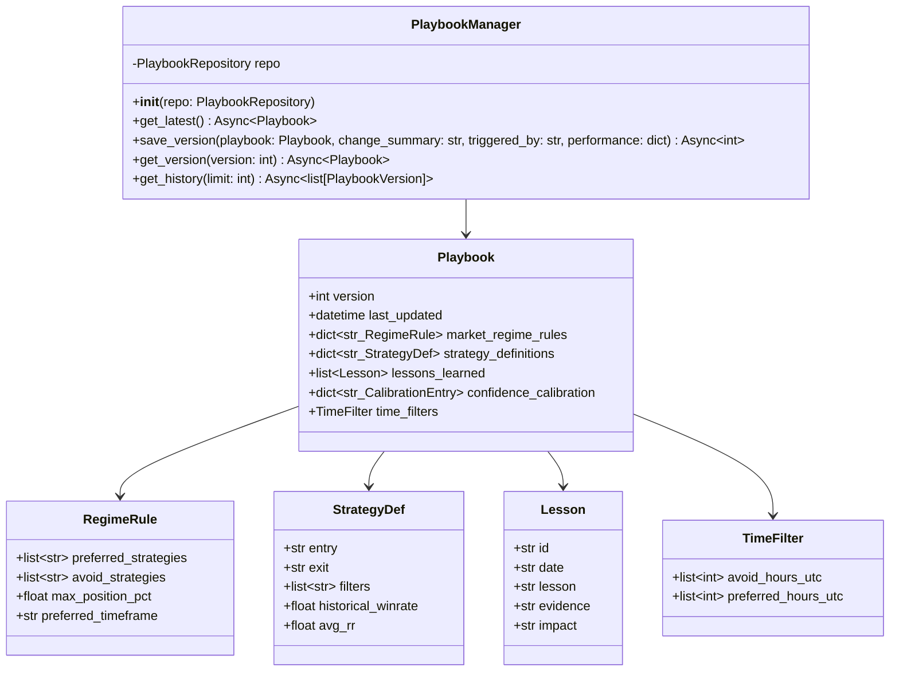

```python
# playbook_manager.py

class PlaybookManager:
    def __init__(self, repo: PlaybookRepository) -> None: ...

    async def get_latest(self) -> Playbook:
        """Load latest playbook version from DB. สร้าง default ถ้ายังไม่มี."""

    async def save_version(
        self,
        playbook: Playbook,
        change_summary: str,
        triggered_by: str,  # "reflection" | "manual" | "init"
        performance: dict,
    ) -> int:
        """Save new version, return version number."""

    async def get_version(self, version: int) -> Playbook:
        """Load specific version."""

    async def get_history(self, limit: int = 20) -> list[PlaybookVersion]:
        """Get version history with change summaries."""
```

---

### 3.9 Perplexity Client (`perplexity_client.py`)

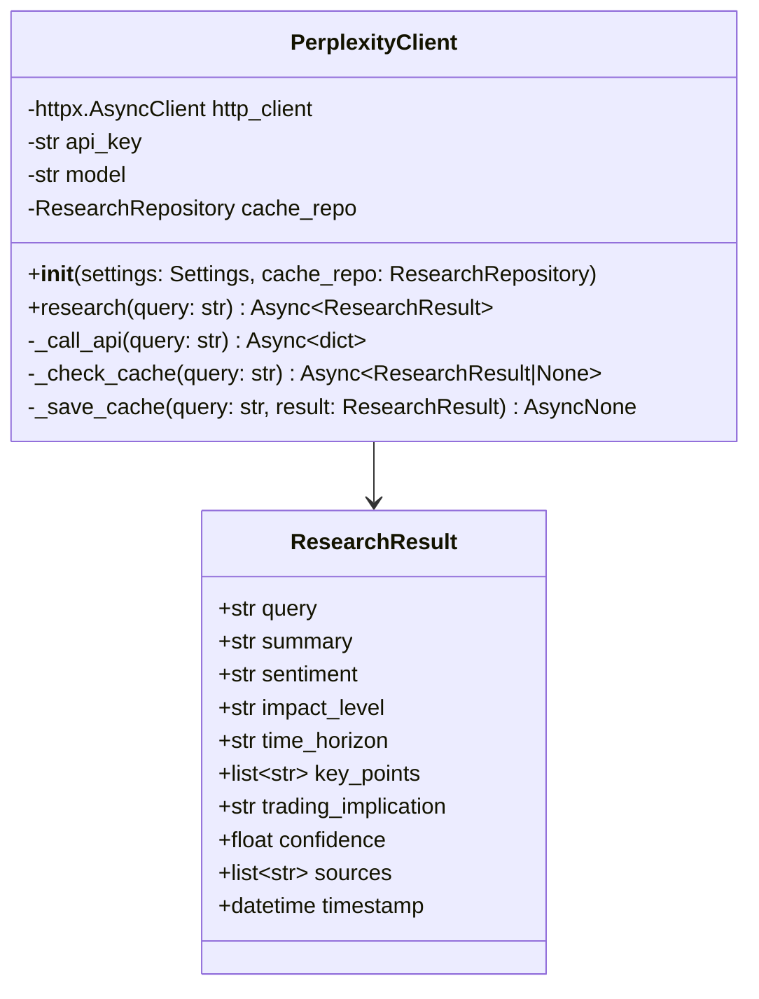

```python
# perplexity_client.py

RESEARCH_SYSTEM_PROMPT = """You are a crypto market research analyst.
Provide concise, factual analysis. Include:
1. Key facts & data points
2. Market sentiment assessment (bullish/bearish/neutral)
3. Potential impact on BTC/ETH price (high/medium/low)
4. Time horizon of impact (immediate/short/medium term)
5. Sources cited
Respond in structured JSON format."""

class PerplexityClient:
    def __init__(self, settings: Settings, cache_repo: ResearchRepository) -> None: ...

    async def research(self, query: str) -> ResearchResult:
        """
        เรียก Perplexity sonar-pro:
        1. Check cache (TTL 1 hour)
        2. ถ้า cache miss → call API
        3. Parse response → ResearchResult
        4. Save to cache

        Trigger conditions (ถูกเรียกเมื่อ):
        - ก่อน scheduled news 30 นาที (FOMC, CPI, NFP, GDP)
        - ราคาเปลี่ยน > 3% ใน 1 ชม.
        - funding rate > 0.05% หรือ < -0.03%
        - OI เปลี่ยน > 10% ใน 4 ชม.
        - Manual trigger ผ่าน Telegram
        - Opus request ข้อมูลเพิ่ม
        """
```

---

### 3.10 News Scheduler (`news_scheduler.py`)

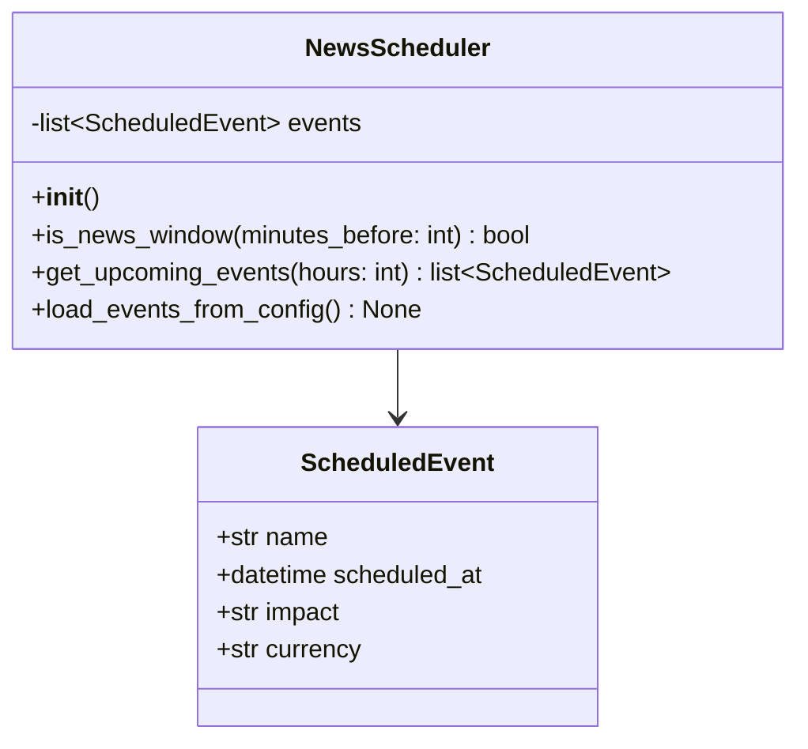

```python
# news_scheduler.py

class NewsScheduler:
    """
    ตรวจสอบว่าใกล้ข่าวสำคัญหรือไม่:
    - FOMC meetings
    - CPI releases
    - NFP (Non-Farm Payrolls)
    - GDP reports
    - Fed speeches

    ใช้ hardcoded schedule + สามารถเพิ่ม events ผ่าน config/DB
    """

    def is_news_window(self, minutes_before: int = 30) -> bool:
        """Return True ถ้าอยู่ภายใน N นาทีก่อนข่าวสำคัญ"""

    def get_upcoming_events(self, hours: int = 24) -> list[ScheduledEvent]:
        """Get events ใน N ชม. ข้างหน้า"""
```

---

### 3.11 Redis Client (`redis_client.py`)

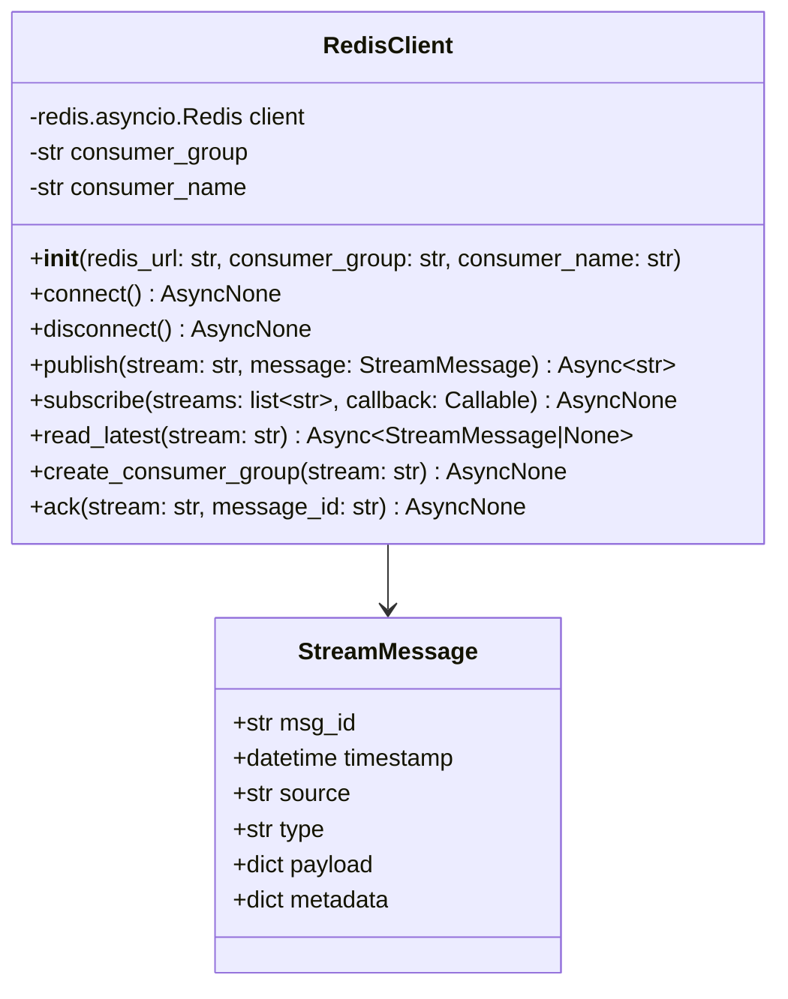

```python
# redis_client.py
import redis.asyncio as aioredis

class RedisClient:
    def __init__(
        self,
        redis_url: str,
        consumer_group: str = "orchestrator",
        consumer_name: str = "orch-1",
    ) -> None: ...

    async def connect(self) -> None:
        """Connect to Redis, create consumer groups if not exist."""

    async def publish(self, stream: str, message: StreamMessage) -> str:
        """XADD message to stream. Returns message ID."""

    async def subscribe(
        self,
        streams: list[str],
        callback: Callable[[str, StreamMessage], Awaitable[None]],
    ) -> None:
        """
        XREADGROUP blocking loop.
        Calls callback(stream_name, message) for each new message.
        Auto-ACK after successful callback.
        """

    async def read_latest(self, stream: str) -> StreamMessage | None:
        """XREVRANGE to get latest message from stream."""
```

---

## 4. Sequence Diagrams

### 4.1 Main Decision Loop (Full Cycle)

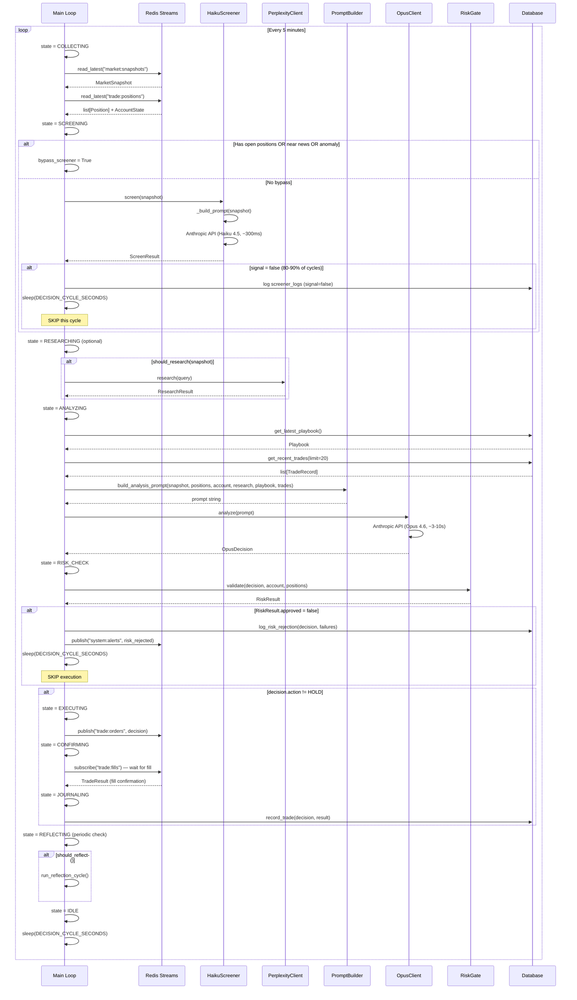

### 4.2 Haiku Screening Flow (Detail)

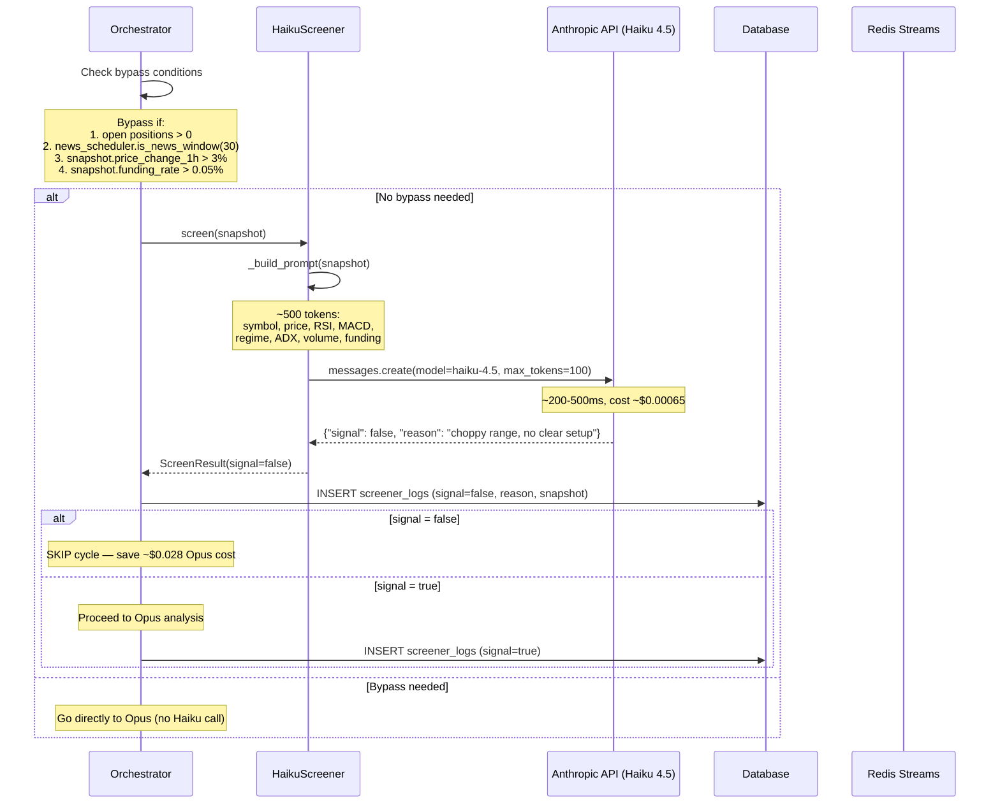

### 4.3 Reflection Cycle (Post-Trade + Deep)

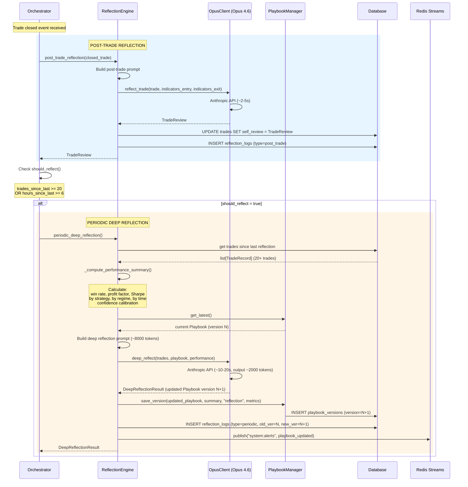

---

## 5. Redis Message Schemas

### 5.1 Orchestrator Publishes

#### `trade:orders` — ส่งคำสั่งเทรดไป Trade Server

```json
{
  "msg_id": "uuid-v4",
  "timestamp": "2026-02-07T10:30:00Z",
  "source": "orchestrator",
  "type": "trade_order",
  "payload": {
    "action": "OPEN_LONG",
    "symbol": "BTC-USDT-SWAP",
    "side": "buy",
    "pos_side": "long",
    "order_type": "market",
    "size": "0.5",
    "limit_price": null,
    "stop_loss": "96500.0",
    "take_profit": "101000.0",
    "leverage": "3",
    "strategy_used": "momentum_breakout",
    "confidence": 0.78,
    "reasoning": "Strong breakout above 99000 resistance with 1.5x volume...",
    "decision_id": "uuid-v4"
  },
  "metadata": {
    "playbook_version": 47,
    "cycle_number": 1234
  }
}
```

#### `opus:decisions` — Broadcast Opus decision (สำหรับ UI/monitoring)

```json
{
  "msg_id": "uuid-v4",
  "timestamp": "2026-02-07T10:30:00Z",
  "source": "orchestrator",
  "type": "opus_decision",
  "payload": {
    "action": "OPEN_LONG",
    "symbol": "BTC-USDT-SWAP",
    "confidence": 0.78,
    "market_regime": "trending_up",
    "bias": "bullish",
    "strategy_used": "momentum_breakout",
    "reasoning": "...",
    "risk_approved": true,
    "screener_signal": true
  },
  "metadata": {
    "opus_latency_ms": 3200,
    "haiku_latency_ms": 350,
    "cycle_number": 1234
  }
}
```

#### `system:alerts` — System-wide alerts

```json
{
  "msg_id": "uuid-v4",
  "timestamp": "2026-02-07T10:30:00Z",
  "source": "orchestrator",
  "type": "system_alert",
  "payload": {
    "severity": "WARN",
    "category": "risk_rejection",
    "title": "Trade rejected by Risk Gate",
    "detail": "Max daily loss threshold reached (-2.8% of -3.0% limit)",
    "action_taken": "Order rejected, no execution"
  }
}
```

### 5.2 Orchestrator Subscribes

| Stream | Message Type | Action |
|--------|-------------|--------|
| `market:snapshots` | `market_snapshot` | อ่าน latest snapshot สำหรับ analysis |
| `market:alerts` | `market_alert` | ตรวจจับ anomaly เพื่อ bypass screener / trigger research |
| `trade:fills` | `trade_fill` | บันทึก fill confirmation, update trade journal |
| `trade:positions` | `position_update` | Track open positions, detect position close, account balance |
| `system:alerts` | `system_alert` | รับคำสั่ง halt/resume/research/config จาก UI (Telegram) |

---

## 6. Database Schema (Orchestrator-Owned Tables)

### 6.1 `trades` — Trade Journal

```sql
CREATE TABLE trades (
    id                  SERIAL PRIMARY KEY,
    trade_id            UUID DEFAULT gen_random_uuid() UNIQUE,

    -- Timing
    opened_at           TIMESTAMPTZ NOT NULL,
    closed_at           TIMESTAMPTZ,
    duration_seconds    INTEGER,

    -- Instrument
    symbol              VARCHAR(30) NOT NULL,
    direction           VARCHAR(5) NOT NULL CHECK (direction IN ('LONG', 'SHORT')),

    -- Prices
    entry_price         DECIMAL(20,8) NOT NULL,
    exit_price          DECIMAL(20,8),
    stop_loss           DECIMAL(20,8) NOT NULL,
    take_profit         DECIMAL(20,8),

    -- Size
    size                DECIMAL(20,8) NOT NULL,
    size_pct            DECIMAL(5,4),
    leverage            DECIMAL(5,2) DEFAULT 1.0,

    -- P&L
    pnl_usd             DECIMAL(20,4),
    pnl_pct             DECIMAL(10,6),
    fees_usd            DECIMAL(20,4),

    -- AI Decision Context
    strategy_used       VARCHAR(50),
    confidence_at_entry DECIMAL(4,3),
    market_regime       VARCHAR(20),
    opus_reasoning      TEXT,

    -- Indicators snapshot (JSON)
    indicators_entry    JSONB,
    indicators_exit     JSONB,

    -- Research context
    research_context    JSONB,

    -- Self-review (written by Opus post-trade)
    self_review         JSONB,

    -- Exit reason
    exit_reason         VARCHAR(30),
    -- e.g. 'take_profit', 'stop_loss', 'manual', 'trailing_stop', 'signal'

    -- Status
    status              VARCHAR(10) DEFAULT 'open'
                        CHECK (status IN ('open', 'closed', 'cancelled')),

    -- OKX IDs
    okx_order_id        VARCHAR(50),
    okx_algo_id         VARCHAR(50),

    -- Timestamps
    created_at          TIMESTAMPTZ DEFAULT NOW(),
    updated_at          TIMESTAMPTZ DEFAULT NOW()
);

-- Indexes
CREATE INDEX idx_trades_symbol ON trades (symbol);
CREATE INDEX idx_trades_status ON trades (status);
CREATE INDEX idx_trades_opened_at ON trades (opened_at DESC);
CREATE INDEX idx_trades_strategy ON trades (strategy_used);
CREATE INDEX idx_trades_regime ON trades (market_regime);
```

### 6.2 `playbook_versions`

```sql
CREATE TABLE playbook_versions (
    id                      SERIAL PRIMARY KEY,
    version                 INTEGER NOT NULL UNIQUE,
    playbook_json           JSONB NOT NULL,
    change_summary          TEXT,
    triggered_by            VARCHAR(30) NOT NULL
                            CHECK (triggered_by IN ('reflection', 'manual', 'init')),
    performance_at_update   JSONB,
    created_at              TIMESTAMPTZ DEFAULT NOW()
);

CREATE INDEX idx_playbook_version ON playbook_versions (version DESC);
```

### 6.3 `reflection_logs`

```sql
CREATE TABLE reflection_logs (
    id                  SERIAL PRIMARY KEY,
    reflection_type     VARCHAR(20) NOT NULL
                        CHECK (reflection_type IN ('post_trade', 'periodic')),
    trade_ids           INTEGER[],
    input_prompt        TEXT,
    output_json         JSONB,
    playbook_changes    JSONB,
    old_version         INTEGER,
    new_version         INTEGER,
    created_at          TIMESTAMPTZ DEFAULT NOW()
);

CREATE INDEX idx_reflection_type ON reflection_logs (reflection_type);
CREATE INDEX idx_reflection_created ON reflection_logs (created_at DESC);
```

### 6.4 `research_cache`

```sql
CREATE TABLE research_cache (
    id              SERIAL PRIMARY KEY,
    query           TEXT NOT NULL,
    response_json   JSONB NOT NULL,
    source          VARCHAR(20) DEFAULT 'perplexity',
    ttl_seconds     INTEGER DEFAULT 3600,
    created_at      TIMESTAMPTZ DEFAULT NOW()
);

CREATE INDEX idx_research_query ON research_cache (query);
CREATE INDEX idx_research_created ON research_cache (created_at DESC);
```

### 6.5 `performance_snapshots`

```sql
CREATE TABLE performance_snapshots (
    id              SERIAL PRIMARY KEY,
    snapshot_type   VARCHAR(20) NOT NULL
                    CHECK (snapshot_type IN ('hourly', 'daily', 'weekly')),
    equity          DECIMAL(20,4),
    total_pnl       DECIMAL(20,4),
    win_rate        DECIMAL(5,4),
    profit_factor   DECIMAL(8,4),
    sharpe_ratio    DECIMAL(8,4),
    max_drawdown    DECIMAL(10,4),
    total_trades    INTEGER,
    metrics_json    JSONB,
    created_at      TIMESTAMPTZ DEFAULT NOW()
);

CREATE INDEX idx_perf_type ON performance_snapshots (snapshot_type);
CREATE INDEX idx_perf_created ON performance_snapshots (created_at DESC);
```

### 6.6 `screener_logs`

```sql
CREATE TABLE screener_logs (
    id              SERIAL PRIMARY KEY,
    symbol          VARCHAR(30) NOT NULL,
    signal          BOOLEAN NOT NULL,
    reason          TEXT,
    snapshot_json   JSONB,
    opus_action     VARCHAR(20),
    opus_agreed     BOOLEAN,
    tokens_used     INTEGER,
    latency_ms      INTEGER,
    created_at      TIMESTAMPTZ DEFAULT NOW()
);

CREATE INDEX idx_screener_created ON screener_logs (created_at DESC);
CREATE INDEX idx_screener_signal ON screener_logs (signal);
```

### 6.7 `risk_rejections`

```sql
CREATE TABLE risk_rejections (
    id              SERIAL PRIMARY KEY,
    decision_json   JSONB NOT NULL,
    failed_rules    JSONB NOT NULL,
    account_state   JSONB,
    created_at      TIMESTAMPTZ DEFAULT NOW()
);

CREATE INDEX idx_risk_created ON risk_rejections (created_at DESC);
```

---

## 7. Configuration Parameters

| Parameter | Default | Description |
|-----------|---------|-------------|
| `DECISION_CYCLE_SECONDS` | 300 | Main loop interval (5 min) |
| `REFLECTION_INTERVAL_TRADES` | 20 | Run deep reflection every N trades |
| `REFLECTION_INTERVAL_HOURS` | 6 | Or every N hours (whichever first) |
| `RESEARCH_BEFORE_NEWS` | True | Auto-research before scheduled news |
| `MAX_OPUS_TIMEOUT_SECONDS` | 30 | Timeout for Opus API call |
| `INSTRUMENTS` | ["BTC-USDT-SWAP"] | Instruments to trade |
| `COOLDOWN_AFTER_LOSS_STREAK` | 1800 | 30 min cooldown after 3 consecutive losses |
| `SCREENER_ENABLED` | True | Enable/disable Haiku pre-filter |
| `SCREENER_BYPASS_ON_POSITION` | True | Skip screener if open position |
| `SCREENER_BYPASS_ON_NEWS` | True | Skip screener near news events |
| `SCREENER_MIN_PASS_RATE` | 0.10 | Alert if pass rate drops below 10% |
| `MAX_DAILY_LOSS_PCT` | 0.03 | -3% equity = HALT |
| `MAX_SINGLE_TRADE_PCT` | 0.05 | Max 5% per trade |
| `MAX_TOTAL_EXPOSURE_PCT` | 0.15 | Max 15% total exposure |
| `MAX_CONCURRENT_POSITIONS` | 3 | Max open positions |
| `MAX_DRAWDOWN_PCT` | 0.10 | -10% from peak = EMERGENCY HALT |
| `MAX_LEVERAGE` | 3.0 | Cap leverage |
| `MAX_SL_DISTANCE_PCT` | 0.03 | Max 3% stop loss distance |
| `MIN_RR_RATIO` | 1.5 | Min risk:reward ratio |

---

## 8. Dependencies

```toml
[project]
name = "orchestrator"
version = "0.1.0"
requires-python = ">=3.12"
dependencies = [
    "anthropic>=0.42.0",
    "httpx>=0.27",
    "redis[hiredis]>=5.0",
    "sqlalchemy[asyncio]>=2.0",
    "asyncpg>=0.29",
    "pydantic>=2.0",
    "pydantic-settings>=2.0",
    "alembic>=1.13",
    "structlog>=24.0",
]
```
