# System Design: INDICATOR + TRADE SERVER

> Repo: `indicator-trade-server` | Python 3.12 + AsyncIO
> Version: 1.0 | February 2026

---

## 1. Overview

Indicator + Trade Server เป็นชั้นเชื่อมต่อกับ OKX Exchange ทั้งหมด แบ่งเป็น 2 subsystems:

**Indicator Server:**
- เชื่อมต่อ OKX WebSocket Public channels (candles, tickers, orderbook, funding rate)
- เก็บ candle data (in-memory + DB)
- คำนวณ Technical Indicators 12 ตัว ใน 3 timeframes (15m, 1H, 4H)
- ตรวจจับ Market Regime (trending_up/down, ranging, volatile)
- Build `MarketSnapshot` แล้ว publish ผ่าน Redis ทุก decision cycle

**Trade Server:**
- รับคำสั่ง order จาก Orchestrator ผ่าน Redis
- Execute orders บน OKX Demo Trading API (flag=1)
- วาง TP/SL algo orders
- Monitor positions + orders ผ่าน OKX WebSocket Private channels
- Publish fills, positions, account updates กลับผ่าน Redis

### Component Diagram

```
┌─────────────────────────────────────────────────────────────────────────┐
│                   INDICATOR + TRADE SERVER                               │
│                                                                          │
│  ┌──────────────────────────────────┐  ┌──────────────────────────────┐  │
│  │       INDICATOR SERVER           │  │       TRADE SERVER           │  │
│  │                                  │  │                              │  │
│  │  ┌────────────┐ ┌─────────────┐  │  │  ┌──────────────┐          │  │
│  │  │ OKXPublicWS│ │ CandleStore │  │  │  │ OrderExecutor│          │  │
│  │  │ (candles,  │─▶│ (memory+DB) │  │  │  │ (place order │          │  │
│  │  │  tickers,  │ └──────┬──────┘  │  │  │  + TP/SL)    │          │  │
│  │  │  books,    │        │         │  │  └──────┬───────┘          │  │
│  │  │  funding)  │        ▼         │  │         │                   │  │
│  │  └────────────┘ ┌─────────────┐  │  │  ┌──────▼───────┐          │  │
│  │                 │ Technical   │  │  │  │ OKXRestClient│          │  │
│  │                 │ Indicators  │  │  │  │ (python-okx) │          │  │
│  │                 │ (pandas-ta) │  │  │  └──────┬───────┘          │  │
│  │                 └──────┬──────┘  │  │         │                   │  │
│  │                        │         │  │  ┌──────▼───────┐          │  │
│  │                 ┌──────▼──────┐  │  │  │ OKXPrivateWS │          │  │
│  │                 │RegimeDetect │  │  │  │ (orders,     │          │  │
│  │                 └──────┬──────┘  │  │  │  positions,  │          │  │
│  │                        │         │  │  │  account)    │          │  │
│  │                 ┌──────▼──────┐  │  │  └──────┬───────┘          │  │
│  │                 │ Snapshot    │  │  │         │                   │  │
│  │                 │ Builder     │  │  │  ┌──────▼───────┐          │  │
│  │                 └──────┬──────┘  │  │  │ Position     │          │  │
│  │                        │         │  │  │ Manager      │          │  │
│  │                        │         │  │  └──────────────┘          │  │
│  └────────────────────────┼─────────┘  └──────────────────────────────┘  │
│                           │                       │                      │
│  ┌────────────────────────▼───────────────────────▼──────────────────┐   │
│  │                     Redis Client                                   │   │
│  │  publish: market:snapshots, market:alerts, trade:fills,           │   │
│  │           trade:positions                                          │   │
│  │  subscribe: trade:orders                                           │   │
│  └────────────────────────────────────────────────────────────────────┘   │
└─────────────────────────────────────────────────────────────────────────┘
                               │
                    ┌──────────▼──────────┐
                    │  OKX Demo Trading   │
                    │  API (flag=1)       │
                    │                     │
                    │  REST: okx.com      │
                    │  WS Public:         │
                    │   wspap.okx.com     │
                    │  WS Private:        │
                    │   wspap.okx.com     │
                    └─────────────────────┘
```

---

## 2. Directory Structure

```
indicator-trade-server/
├── Dockerfile
├── pyproject.toml
├── src/
│   └── indicator_trade/
│       ├── __init__.py
│       ├── main.py                        # Entry point: start ทั้ง indicator + trade server
│       ├── config.py                      # OKX credentials, Redis, DB settings
│       │
│       ├── indicator/
│       │   ├── __init__.py
│       │   ├── server.py                  # Indicator server main loop
│       │   ├── ws_public.py               # OKX Public WebSocket client wrapper
│       │   ├── candle_store.py            # In-memory (deque) + DB candle storage
│       │   ├── indicators.py              # Technical indicator calculations
│       │   ├── regime_detector.py         # Market regime classification
│       │   └── snapshot_builder.py        # Assemble MarketSnapshot from all data
│       │
│       ├── trade/
│       │   ├── __init__.py
│       │   ├── server.py                  # Trade server main loop (Redis subscriber)
│       │   ├── okx_rest.py                # OKX REST API wrapper (python-okx SDK)
│       │   ├── ws_private.py              # OKX Private WebSocket wrapper
│       │   ├── order_executor.py          # Place orders + TP/SL algo orders
│       │   ├── position_manager.py        # Track positions, detect closes
│       │   └── order_validator.py         # Pre-execution validation (size, price)
│       │
│       ├── models/
│       │   ├── __init__.py
│       │   ├── candle.py                  # OHLCV Pydantic model
│       │   ├── ticker.py                  # Ticker (last, bid, ask, vol)
│       │   ├── indicator_set.py           # IndicatorSet (RSI, MACD, BB, etc.)
│       │   ├── snapshot.py                # MarketSnapshot (full)
│       │   ├── order.py                   # OrderRequest, OrderResult
│       │   ├── position.py                # Position, AccountState
│       │   └── messages.py                # Redis Stream message schemas
│       │
│       ├── db/
│       │   ├── __init__.py
│       │   ├── engine.py                  # AsyncEngine + session factory
│       │   └── candle_repository.py       # Candle CRUD (TimescaleDB)
│       │
│       └── redis_client.py                # Redis Streams publish/subscribe
│
└── tests/
    ├── conftest.py
    ├── test_indicators.py
    ├── test_regime_detector.py
    ├── test_order_executor.py
    ├── test_order_validator.py
    ├── test_snapshot_builder.py
    └── test_position_manager.py
```

---

## 3. OKX API Reference

### 3.1 API Configuration

```python
# OKX Demo Trading
OKX_FLAG = "1"                    # 0=Production, 1=Demo
REST_BASE = "https://www.okx.com"  # Same URL, differentiated by flag header

# WebSocket URLs (Demo)
WS_PUBLIC  = "wss://wspap.okx.com:8443/ws/v5/public"
WS_PRIVATE = "wss://wspap.okx.com:8443/ws/v5/private"
WS_BUSINESS = "wss://wspap.okx.com:8443/ws/v5/business"

# Authentication header for demo
HEADERS = {
    "x-simulated-trading": "1",  # Demo trading header
}
```

### 3.2 REST Endpoints Used

**Market Data (Public)**

| Method | Endpoint | Purpose |
|--------|----------|---------|
| GET | `/api/v5/market/candles` | OHLCV candles (max 300/request) |
| GET | `/api/v5/market/ticker` | Current price, 24h vol, bid/ask |
| GET | `/api/v5/market/books` | Order book depth |
| GET | `/api/v5/market/trades` | Recent trades |
| GET | `/api/v5/market/history-candles` | Historical candles |
| GET | `/api/v5/public/funding-rate` | Current & predicted funding |
| GET | `/api/v5/public/open-interest` | Open interest |
| GET | `/api/v5/rubik/stat/taker-volume` | Taker buy/sell ratio |
| GET | `/api/v5/rubik/stat/contracts/long-short-account-ratio` | Long/Short ratio |

**Account (Private)**

| Method | Endpoint | Purpose |
|--------|----------|---------|
| GET | `/api/v5/account/balance` | Equity, available margin |
| GET | `/api/v5/account/positions` | Open positions |
| POST | `/api/v5/account/set-leverage` | Set leverage per instrument |
| GET | `/api/v5/account/config` | Account mode config |

**Order Management (Private)**

| Method | Endpoint | Purpose |
|--------|----------|---------|
| POST | `/api/v5/trade/order` | Place single order |
| POST | `/api/v5/trade/cancel-order` | Cancel pending order |
| POST | `/api/v5/trade/amend-order` | Amend order price/size |
| POST | `/api/v5/trade/close-position` | Close position (market) |
| POST | `/api/v5/trade/order-algo` | Place TP/SL algo orders |
| GET | `/api/v5/trade/orders-pending` | List pending orders |
| GET | `/api/v5/trade/orders-history` | Order history (7 days) |
| GET | `/api/v5/trade/fills` | Trade fill details |

### 3.3 WebSocket Channels

**Public Channels (No Auth)**

| Channel | Args | Purpose |
|---------|------|---------|
| `candle5m` | `{instId}` | 5-minute candle updates |
| `candle1H` | `{instId}` | 1-hour candle updates |
| `candle4H` | `{instId}` | 4-hour candle updates |
| `tickers` | `{instId}` | Real-time ticker (last, bid, ask, vol) |
| `books5` | `{instId}` | Order book top 5 levels |
| `funding-rate` | `{instId}` | Funding rate updates |

**Private Channels (Auth Required)**

| Channel | Args | Purpose |
|---------|------|---------|
| `orders` | `{instType: "SWAP"}` | Order status changes |
| `positions` | `{instType: "SWAP"}` | Position updates (PnL, liqPx) |
| `account` | — | Account balance changes |

### 3.4 Authentication

```python
# OKX API v5 HMAC-SHA256 Authentication
import hmac, hashlib, base64

def sign_request(timestamp: str, method: str, path: str, body: str, secret_key: str) -> str:
    message = f"{timestamp}{method}{path}{body}"
    mac = hmac.new(
        secret_key.encode('utf-8'),
        message.encode('utf-8'),
        hashlib.sha256
    )
    return base64.b64encode(mac.digest()).decode()

# Required headers for private endpoints:
# OK-ACCESS-KEY, OK-ACCESS-SIGN, OK-ACCESS-TIMESTAMP,
# OK-ACCESS-PASSPHRASE, x-simulated-trading
```

---

## 4. Class Diagrams + Method Signatures

### 4.1 Config (`config.py`)

```python
# config.py
from pydantic_settings import BaseSettings

class Settings(BaseSettings):
    # --- OKX ---
    OKX_API_KEY: str
    OKX_SECRET_KEY: str
    OKX_PASSPHRASE: str
    OKX_FLAG: str = "1"  # 1 = Demo Trading

    # --- WebSocket URLs ---
    WS_PUBLIC_URL: str = "wss://wspap.okx.com:8443/ws/v5/public"
    WS_PRIVATE_URL: str = "wss://wspap.okx.com:8443/ws/v5/private"

    # --- Infrastructure ---
    DATABASE_URL: str
    REDIS_URL: str = "redis://redis:6379"

    # --- Instruments ---
    INSTRUMENTS: list[str] = ["BTC-USDT-SWAP"]
    TIMEFRAMES: list[str] = ["5m", "1H", "4H"]

    # --- Indicator ---
    CANDLE_HISTORY_LIMIT: int = 200       # candles to keep in memory per TF
    SNAPSHOT_INTERVAL_SECONDS: int = 300   # publish snapshot every N seconds
    ORDERBOOK_DEPTH: int = 20

    # --- Trade ---
    ORDER_TIMEOUT_SECONDS: int = 30       # timeout waiting for fill
    MAX_RETRIES: int = 3

    model_config = {"env_prefix": "", "case_sensitive": True}
```

---

### 4.2 Indicator Server (`indicator/server.py`)

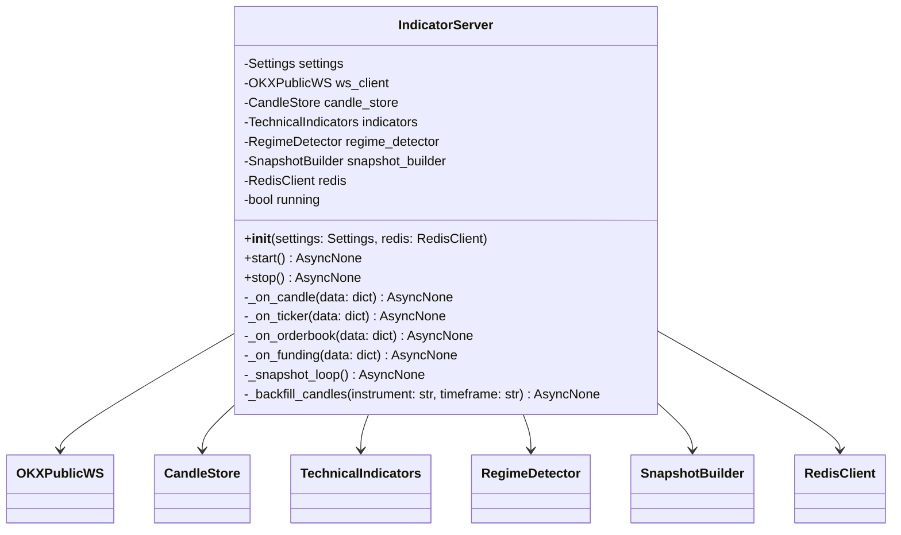
```mermaid
classDiagram
    class IndicatorServer {
        -Settings settings
        -OKXPublicWS ws_client
        -CandleStore candle_store
        -TechnicalIndicators indicators
        -RegimeDetector regime_detector
        -SnapshotBuilder snapshot_builder
        -RedisClient redis
        -bool running
        +__init__(settings: Settings, redis: RedisClient)
        +start() AsyncNone
        +stop() AsyncNone
        -_on_candle(data: dict) AsyncNone
        -_on_ticker(data: dict) AsyncNone
        -_on_orderbook(data: dict) AsyncNone
        -_on_funding(data: dict) AsyncNone
        -_snapshot_loop() AsyncNone
        -_backfill_candles(instrument: str, timeframe: str) AsyncNone
    }

    IndicatorServer --> OKXPublicWS
    IndicatorServer --> CandleStore
    IndicatorServer --> TechnicalIndicators
    IndicatorServer --> RegimeDetector
    IndicatorServer --> SnapshotBuilder
    IndicatorServer --> RedisClient
```

```python
# indicator/server.py

class IndicatorServer:
    def __init__(self, settings: Settings, redis: RedisClient) -> None: ...

    async def start(self) -> None:
        """
        1. Backfill historical candles จาก REST API (200 candles per TF)
        2. Subscribe WebSocket channels: candle5m, candle1H, candle4H,
           tickers, books5, funding-rate
        3. Start snapshot_loop (publish every SNAPSHOT_INTERVAL_SECONDS)
        """

    async def stop(self) -> None:
        """Gracefully close WebSocket connections, flush pending DB writes."""

    async def _on_candle(self, data: dict) -> None:
        """
        WebSocket candle callback:
        1. Parse candle data
        2. Update CandleStore (in-memory deque)
        3. Persist to DB (TimescaleDB)
        4. Recalculate indicators for affected timeframe
        """

    async def _on_ticker(self, data: dict) -> None:
        """Update latest ticker data (price, volume, bid/ask)."""

    async def _on_orderbook(self, data: dict) -> None:
        """Update orderbook snapshot (top N levels)."""

    async def _on_funding(self, data: dict) -> None:
        """Update current + predicted funding rate."""

    async def _snapshot_loop(self) -> None:
        """
        Loop ทุก SNAPSHOT_INTERVAL_SECONDS:
        1. Build MarketSnapshot via SnapshotBuilder
        2. Publish to Redis "market:snapshots"
        3. Check for anomalies → publish "market:alerts" if detected
        """

    async def _backfill_candles(self, instrument: str, timeframe: str) -> None:
        """
        ดึง historical candles จาก OKX REST API:
        GET /api/v5/market/candles?instId={inst}&bar={tf}&limit=200
        เก็บลง CandleStore + DB
        """
```

---

### 4.3 OKX Public WebSocket (`indicator/ws_public.py`)

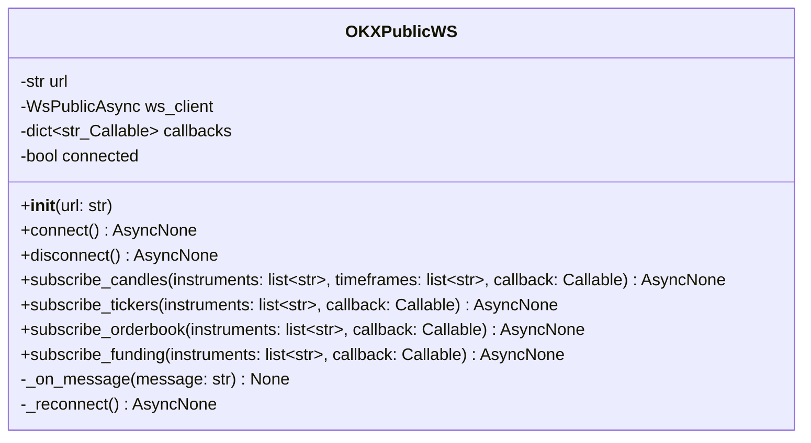
```mermaid
classDiagram
    class OKXPublicWS {
        -str url
        -WsPublicAsync ws_client
        -dict~str_Callable~ callbacks
        -bool connected
        +__init__(url: str)
        +connect() AsyncNone
        +disconnect() AsyncNone
        +subscribe_candles(instruments: list~str~, timeframes: list~str~, callback: Callable) AsyncNone
        +subscribe_tickers(instruments: list~str~, callback: Callable) AsyncNone
        +subscribe_orderbook(instruments: list~str~, callback: Callable) AsyncNone
        +subscribe_funding(instruments: list~str~, callback: Callable) AsyncNone
        -_on_message(message: str) None
        -_reconnect() AsyncNone
    }
```

```python
# indicator/ws_public.py
from okx.websocket.WsPublicAsync import WsPublicAsync

class OKXPublicWS:
    def __init__(self, url: str) -> None: ...

    async def connect(self) -> None:
        """Initialize WsPublicAsync, start connection."""

    async def disconnect(self) -> None:
        """Close WebSocket connection."""

    async def subscribe_candles(
        self,
        instruments: list[str],
        timeframes: list[str],
        callback: Callable[[dict], Awaitable[None]],
    ) -> None:
        """
        Subscribe to candle channels:
        e.g. [{"channel": "candle5m", "instId": "BTC-USDT-SWAP"},
              {"channel": "candle1H", "instId": "BTC-USDT-SWAP"},
              {"channel": "candle4H", "instId": "BTC-USDT-SWAP"}]
        """

    async def subscribe_tickers(
        self,
        instruments: list[str],
        callback: Callable[[dict], Awaitable[None]],
    ) -> None:
        """Subscribe to tickers channel for real-time price."""

    async def subscribe_orderbook(
        self,
        instruments: list[str],
        callback: Callable[[dict], Awaitable[None]],
    ) -> None:
        """Subscribe to books5 channel for top 5 order book levels."""

    async def subscribe_funding(
        self,
        instruments: list[str],
        callback: Callable[[dict], Awaitable[None]],
    ) -> None:
        """Subscribe to funding-rate channel."""

    def _on_message(self, message: str) -> None:
        """
        Route incoming WS message to appropriate callback
        based on channel name in data['arg']['channel'].
        """

    async def _reconnect(self) -> None:
        """Auto-reconnect with exponential backoff on disconnect."""
```

---

### 4.4 Candle Store (`indicator/candle_store.py`)

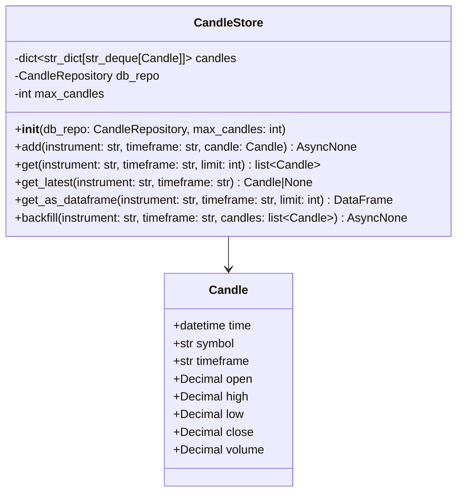
```mermaid
classDiagram
    class CandleStore {
        -dict~str_dict[str_deque[Candle]]~ candles
        -CandleRepository db_repo
        -int max_candles
        +__init__(db_repo: CandleRepository, max_candles: int)
        +add(instrument: str, timeframe: str, candle: Candle) AsyncNone
        +get(instrument: str, timeframe: str, limit: int) list~Candle~
        +get_latest(instrument: str, timeframe: str) Candle|None
        +get_as_dataframe(instrument: str, timeframe: str, limit: int) DataFrame
        +backfill(instrument: str, timeframe: str, candles: list~Candle~) AsyncNone
    }

    class Candle {
        +datetime time
        +str symbol
        +str timeframe
        +Decimal open
        +Decimal high
        +Decimal low
        +Decimal close
        +Decimal volume
    }

    CandleStore --> Candle
```

```python
# indicator/candle_store.py
from collections import deque
import pandas as pd

class CandleStore:
    """
    In-memory candle storage ใช้ deque (FIFO, max 200 per instrument+timeframe)
    + persist to TimescaleDB สำหรับ historical queries.

    Structure: candles[instrument][timeframe] = deque([Candle, ...])
    """

    def __init__(self, db_repo: CandleRepository, max_candles: int = 200) -> None: ...

    async def add(self, instrument: str, timeframe: str, candle: Candle) -> None:
        """
        1. Append to in-memory deque
        2. Persist to DB (upsert on conflict)
        """

    def get(self, instrument: str, timeframe: str, limit: int = 100) -> list[Candle]:
        """Get last N candles from in-memory store."""

    def get_latest(self, instrument: str, timeframe: str) -> Candle | None:
        """Get the most recent candle."""

    def get_as_dataframe(
        self, instrument: str, timeframe: str, limit: int = 100
    ) -> pd.DataFrame:
        """
        Convert candles to pandas DataFrame สำหรับ pandas-ta:
        columns: ['open', 'high', 'low', 'close', 'volume']
        index: DatetimeIndex
        """

    async def backfill(
        self, instrument: str, timeframe: str, candles: list[Candle]
    ) -> None:
        """Bulk insert historical candles to memory + DB."""
```

---

### 4.5 Technical Indicators (`indicator/indicators.py`)

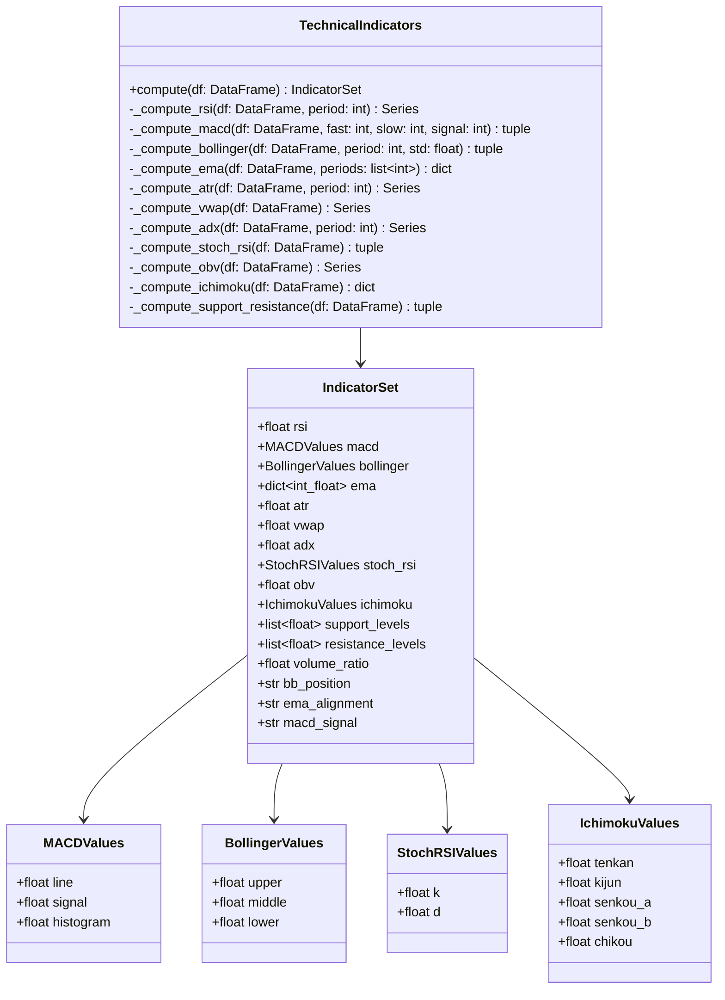
```mermaid
classDiagram
    class TechnicalIndicators {
        +compute(df: DataFrame) IndicatorSet
        -_compute_rsi(df: DataFrame, period: int) Series
        -_compute_macd(df: DataFrame, fast: int, slow: int, signal: int) tuple
        -_compute_bollinger(df: DataFrame, period: int, std: float) tuple
        -_compute_ema(df: DataFrame, periods: list~int~) dict
        -_compute_atr(df: DataFrame, period: int) Series
        -_compute_vwap(df: DataFrame) Series
        -_compute_adx(df: DataFrame, period: int) Series
        -_compute_stoch_rsi(df: DataFrame) tuple
        -_compute_obv(df: DataFrame) Series
        -_compute_ichimoku(df: DataFrame) dict
        -_compute_support_resistance(df: DataFrame) tuple
    }

    class IndicatorSet {
        +float rsi
        +MACDValues macd
        +BollingerValues bollinger
        +dict~int_float~ ema
        +float atr
        +float vwap
        +float adx
        +StochRSIValues stoch_rsi
        +float obv
        +IchimokuValues ichimoku
        +list~float~ support_levels
        +list~float~ resistance_levels
        +float volume_ratio
        +str bb_position
        +str ema_alignment
        +str macd_signal
    }

    class MACDValues {
        +float line
        +float signal
        +float histogram
    }

    class BollingerValues {
        +float upper
        +float middle
        +float lower
    }

    class StochRSIValues {
        +float k
        +float d
    }

    class IchimokuValues {
        +float tenkan
        +float kijun
        +float senkou_a
        +float senkou_b
        +float chikou
    }

    TechnicalIndicators --> IndicatorSet
    IndicatorSet --> MACDValues
    IndicatorSet --> BollingerValues
    IndicatorSet --> StochRSIValues
    IndicatorSet --> IchimokuValues
```

```python
# indicator/indicators.py
import pandas as pd
import pandas_ta as ta

class TechnicalIndicators:
    """
    คำนวณ Technical Indicators ทั้ง 12 ตัว จาก OHLCV DataFrame:

    | Indicator         | Parameters    | Purpose                          |
    |-------------------|--------------|----------------------------------|
    | RSI               | period=14    | Overbought/Oversold              |
    | MACD              | 12, 26, 9    | Trend momentum + crossover       |
    | Bollinger Bands   | 20, 2.0      | Volatility + mean reversion      |
    | EMA               | 20, 50, 200  | Trend direction + S/R            |
    | ATR               | period=14    | Volatility for SL sizing         |
    | VWAP              | session      | Institutional fair value          |
    | ADX               | period=14    | Trend strength (>25 = trending)  |
    | Stochastic RSI    | 14,14,3,3    | Fine-grained momentum            |
    | OBV               | cumulative   | Volume-price divergence           |
    | Ichimoku Cloud    | 9, 26, 52    | Multi-factor trend + S/R         |
    | Support/Resistance| pivots+fractals | Key price levels              |
    | Volume Profile    | 24h bins     | High volume nodes                |
    """

    def compute(self, df: pd.DataFrame) -> IndicatorSet:
        """
        Compute all indicators from OHLCV DataFrame.

        Args:
            df: DataFrame with columns ['open','high','low','close','volume']
                at least 200 rows for accurate calculations.

        Returns:
            IndicatorSet with all computed values.
        """

    def _compute_rsi(self, df: pd.DataFrame, period: int = 14) -> pd.Series:
        """RSI(14) using pandas-ta: ta.rsi(df['close'], length=14)"""

    def _compute_macd(
        self, df: pd.DataFrame, fast: int = 12, slow: int = 26, signal: int = 9
    ) -> tuple[float, float, float]:
        """MACD line, signal, histogram"""

    def _compute_bollinger(
        self, df: pd.DataFrame, period: int = 20, std: float = 2.0
    ) -> tuple[float, float, float]:
        """Upper, middle, lower bands"""

    def _compute_ema(
        self, df: pd.DataFrame, periods: list[int] = [20, 50, 200]
    ) -> dict[int, float]:
        """EMA values for each period: {20: 97950.0, 50: 96800.0, 200: 94200.0}"""

    def _compute_atr(self, df: pd.DataFrame, period: int = 14) -> pd.Series:
        """Average True Range for stop-loss sizing"""

    def _compute_vwap(self, df: pd.DataFrame) -> pd.Series:
        """VWAP calculation"""

    def _compute_adx(self, df: pd.DataFrame, period: int = 14) -> pd.Series:
        """ADX for trend strength"""

    def _compute_stoch_rsi(self, df: pd.DataFrame) -> tuple[float, float]:
        """Stochastic RSI K and D values"""

    def _compute_obv(self, df: pd.DataFrame) -> pd.Series:
        """On-Balance Volume"""

    def _compute_ichimoku(self, df: pd.DataFrame) -> dict:
        """Ichimoku Cloud values: tenkan, kijun, senkou_a, senkou_b, chikou"""

    def _compute_support_resistance(
        self, df: pd.DataFrame
    ) -> tuple[list[float], list[float]]:
        """
        Find support and resistance levels using:
        1. Pivot points (classic)
        2. Fractal highs/lows
        Returns: (support_levels, resistance_levels) sorted by proximity to current price
        """
```

---

### 4.6 Regime Detector (`indicator/regime_detector.py`)

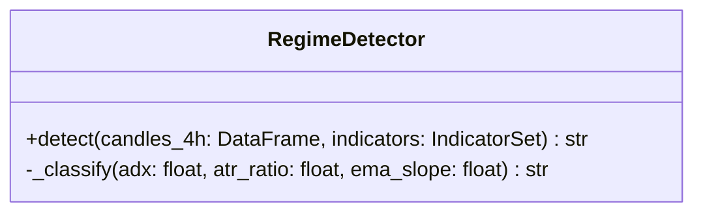
```mermaid
classDiagram
    class RegimeDetector {
        +detect(candles_4h: DataFrame, indicators: IndicatorSet) str
        -_classify(adx: float, atr_ratio: float, ema_slope: float) str
    }
```

```python
# indicator/regime_detector.py

class RegimeDetector:
    """
    Market Regime Detection ใช้ข้อมูลจาก 4H timeframe:

    | Condition                          | Regime        |
    |------------------------------------|---------------|
    | ADX > 25 AND EMA20 slope > 0.2%   | trending_up   |
    | ADX > 25 AND EMA20 slope < -0.2%  | trending_down |
    | ATR ratio > 1.5 (vs 20-period avg)| volatile      |
    | Otherwise                          | ranging       |
    """

    def detect(self, candles_4h: pd.DataFrame, indicators: IndicatorSet) -> str:
        """
        Returns: "trending_up" | "trending_down" | "ranging" | "volatile"
        """

    def _classify(self, adx: float, atr_ratio: float, ema_slope: float) -> str:
        """
        Classification logic:
        1. if adx > 25 and ema_slope > 0.002: return "trending_up"
        2. if adx > 25 and ema_slope < -0.002: return "trending_down"
        3. if atr_ratio > 1.5: return "volatile"
        4. else: return "ranging"
        """
```

---

### 4.7 Snapshot Builder (`indicator/snapshot_builder.py`)

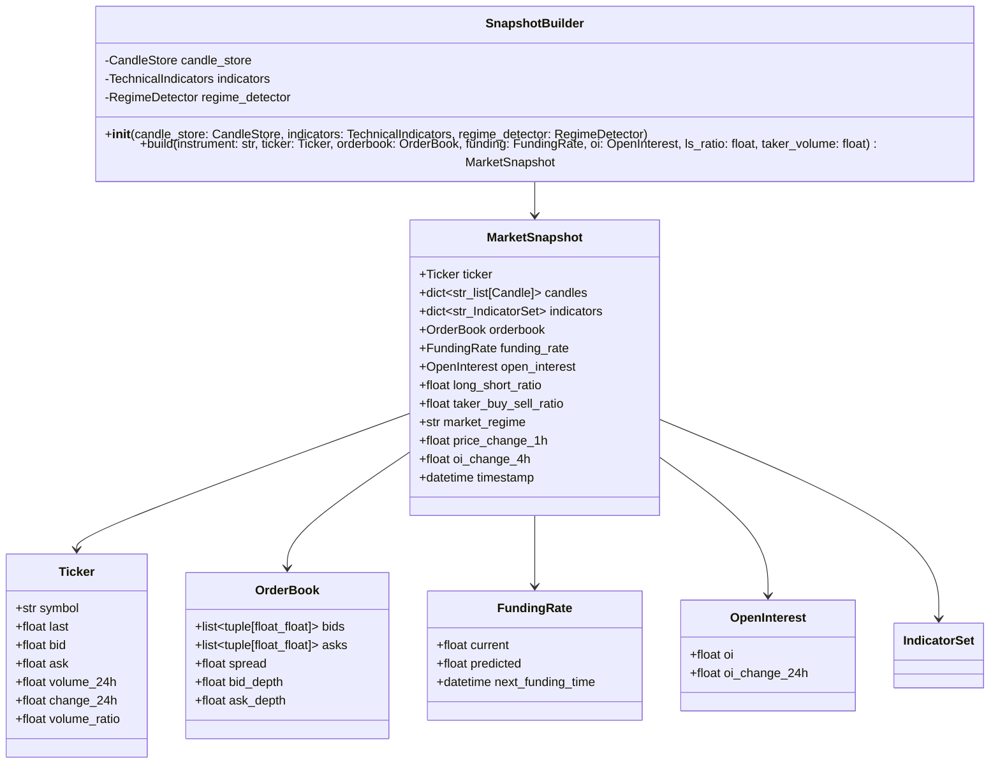
```mermaid
classDiagram
    class SnapshotBuilder {
        -CandleStore candle_store
        -TechnicalIndicators indicators
        -RegimeDetector regime_detector
        +__init__(candle_store: CandleStore, indicators: TechnicalIndicators, regime_detector: RegimeDetector)
        +build(instrument: str, ticker: Ticker, orderbook: OrderBook, funding: FundingRate, oi: OpenInterest, ls_ratio: float, taker_volume: float) MarketSnapshot
    }

    class MarketSnapshot {
        +Ticker ticker
        +dict~str_list[Candle]~ candles
        +dict~str_IndicatorSet~ indicators
        +OrderBook orderbook
        +FundingRate funding_rate
        +OpenInterest open_interest
        +float long_short_ratio
        +float taker_buy_sell_ratio
        +str market_regime
        +float price_change_1h
        +float oi_change_4h
        +datetime timestamp
    }

    class Ticker {
        +str symbol
        +float last
        +float bid
        +float ask
        +float volume_24h
        +float change_24h
        +float volume_ratio
    }

    class OrderBook {
        +list~tuple[float_float]~ bids
        +list~tuple[float_float]~ asks
        +float spread
        +float bid_depth
        +float ask_depth
    }

    class FundingRate {
        +float current
        +float predicted
        +datetime next_funding_time
    }

    class OpenInterest {
        +float oi
        +float oi_change_24h
    }

    SnapshotBuilder --> MarketSnapshot
    MarketSnapshot --> Ticker
    MarketSnapshot --> OrderBook
    MarketSnapshot --> FundingRate
    MarketSnapshot --> OpenInterest
    MarketSnapshot --> IndicatorSet
```

```python
# indicator/snapshot_builder.py

class SnapshotBuilder:
    def __init__(
        self,
        candle_store: CandleStore,
        indicators: TechnicalIndicators,
        regime_detector: RegimeDetector,
    ) -> None: ...

    def build(
        self,
        instrument: str,
        ticker: Ticker,
        orderbook: OrderBook,
        funding: FundingRate,
        oi: OpenInterest,
        ls_ratio: float,
        taker_volume: float,
    ) -> MarketSnapshot:
        """
        Assemble MarketSnapshot from all data sources:
        1. Get candles from CandleStore (15m, 1H, 4H)
        2. Compute indicators for each timeframe
        3. Detect market regime from 4H data
        4. Calculate derived metrics (price_change_1h, oi_change_4h)
        5. Return complete MarketSnapshot
        """
```

---

### 4.8 Trade Server (`trade/server.py`)

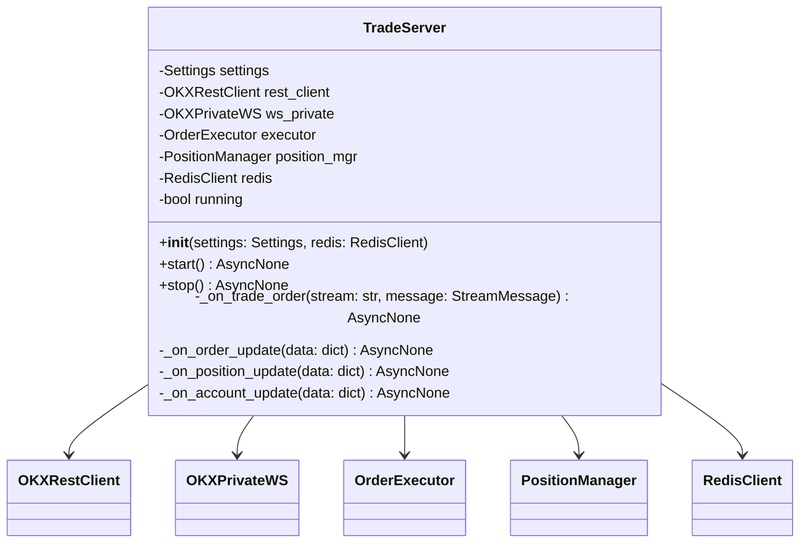
```mermaid
classDiagram
    class TradeServer {
        -Settings settings
        -OKXRestClient rest_client
        -OKXPrivateWS ws_private
        -OrderExecutor executor
        -PositionManager position_mgr
        -RedisClient redis
        -bool running
        +__init__(settings: Settings, redis: RedisClient)
        +start() AsyncNone
        +stop() AsyncNone
        -_on_trade_order(stream: str, message: StreamMessage) AsyncNone
        -_on_order_update(data: dict) AsyncNone
        -_on_position_update(data: dict) AsyncNone
        -_on_account_update(data: dict) AsyncNone
    }

    TradeServer --> OKXRestClient
    TradeServer --> OKXPrivateWS
    TradeServer --> OrderExecutor
    TradeServer --> PositionManager
    TradeServer --> RedisClient
```

```python
# trade/server.py

class TradeServer:
    def __init__(self, settings: Settings, redis: RedisClient) -> None: ...

    async def start(self) -> None:
        """
        1. Initialize OKX REST client
        2. Connect OKX Private WebSocket
        3. Subscribe to orders, positions, account channels
        4. Subscribe Redis "trade:orders" for incoming commands
        5. Set leverage for all instruments
        """

    async def stop(self) -> None:
        """Close all connections."""

    async def _on_trade_order(self, stream: str, message: StreamMessage) -> None:
        """
        Redis subscriber callback สำหรับ "trade:orders":
        1. Parse OrderRequest from message
        2. Validate via OrderValidator
        3. Execute via OrderExecutor
        4. Publish result to "trade:fills"
        """

    async def _on_order_update(self, data: dict) -> None:
        """
        OKX Private WS callback สำหรับ orders channel:
        - Track order state changes (live → filled → canceled)
        - Publish fill events to Redis "trade:fills"
        """

    async def _on_position_update(self, data: dict) -> None:
        """
        OKX Private WS callback สำหรับ positions channel:
        - Update PositionManager
        - Publish position changes to Redis "trade:positions"
        - Detect position close (pos == 0)
        """

    async def _on_account_update(self, data: dict) -> None:
        """
        OKX Private WS callback สำหรับ account channel:
        - Track account balance changes
        - Publish to Redis for Orchestrator
        """
```

---

### 4.9 OKX REST Client (`trade/okx_rest.py`)

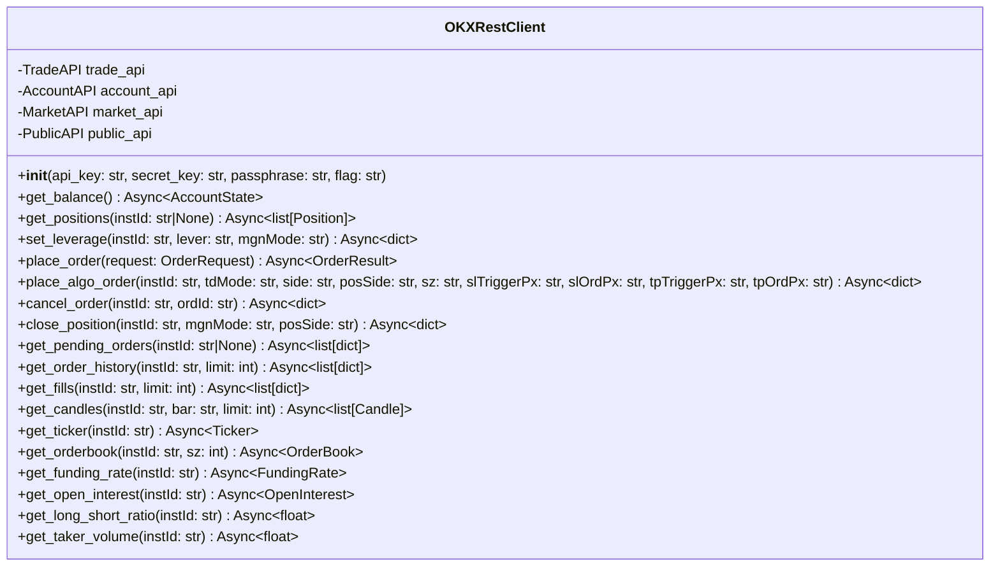
```mermaid
classDiagram
    class OKXRestClient {
        -TradeAPI trade_api
        -AccountAPI account_api
        -MarketAPI market_api
        -PublicAPI public_api
        +__init__(api_key: str, secret_key: str, passphrase: str, flag: str)
        +get_balance() Async~AccountState~
        +get_positions(instId: str|None) Async~list[Position]~
        +set_leverage(instId: str, lever: str, mgnMode: str) Async~dict~
        +place_order(request: OrderRequest) Async~OrderResult~
        +place_algo_order(instId: str, tdMode: str, side: str, posSide: str, sz: str, slTriggerPx: str, slOrdPx: str, tpTriggerPx: str, tpOrdPx: str) Async~dict~
        +cancel_order(instId: str, ordId: str) Async~dict~
        +close_position(instId: str, mgnMode: str, posSide: str) Async~dict~
        +get_pending_orders(instId: str|None) Async~list[dict]~
        +get_order_history(instId: str, limit: int) Async~list[dict]~
        +get_fills(instId: str, limit: int) Async~list[dict]~
        +get_candles(instId: str, bar: str, limit: int) Async~list[Candle]~
        +get_ticker(instId: str) Async~Ticker~
        +get_orderbook(instId: str, sz: int) Async~OrderBook~
        +get_funding_rate(instId: str) Async~FundingRate~
        +get_open_interest(instId: str) Async~OpenInterest~
        +get_long_short_ratio(instId: str) Async~float~
        +get_taker_volume(instId: str) Async~float~
    }
```

```python
# trade/okx_rest.py
import okx.Trade as Trade
import okx.Account as Account
import okx.MarketData as Market
import okx.PublicData as Public

class OKXRestClient:
    """
    Wrapper around python-okx SDK.
    All methods use flag='1' (Demo Trading).
    """

    def __init__(
        self,
        api_key: str,
        secret_key: str,
        passphrase: str,
        flag: str = "1",
    ) -> None:
        self.trade_api = Trade.TradeAPI(api_key, secret_key, passphrase, False, flag)
        self.account_api = Account.AccountAPI(api_key, secret_key, passphrase, False, flag)
        self.market_api = Market.MarketAPI(flag=flag)
        self.public_api = Public.PublicAPI(flag=flag)

    async def place_order(self, request: OrderRequest) -> OrderResult:
        """
        Place single order:
        tradeAPI.place_order(
            instId, tdMode='cross', side, posSide, ordType, sz, px
        )

        Returns OrderResult with ordId + status.
        Raises on API error.
        """

    async def place_algo_order(
        self,
        instId: str,
        tdMode: str,
        side: str,
        posSide: str,
        sz: str,
        slTriggerPx: str,
        slOrdPx: str = "-1",
        tpTriggerPx: str | None = None,
        tpOrdPx: str = "-1",
    ) -> dict:
        """
        Place TP/SL algo order:
        tradeAPI.place_algo_order(
            instId, tdMode, side, posSide,
            ordType='conditional',
            sz, slTriggerPx, slOrdPx, tpTriggerPx, tpOrdPx
        )
        """

    async def get_balance(self) -> AccountState:
        """GET /api/v5/account/balance → AccountState(equity, available, daily_pnl)"""

    async def get_positions(self, instId: str | None = None) -> list[Position]:
        """GET /api/v5/account/positions → list[Position]"""
```

---

### 4.10 OKX Private WebSocket (`trade/ws_private.py`)

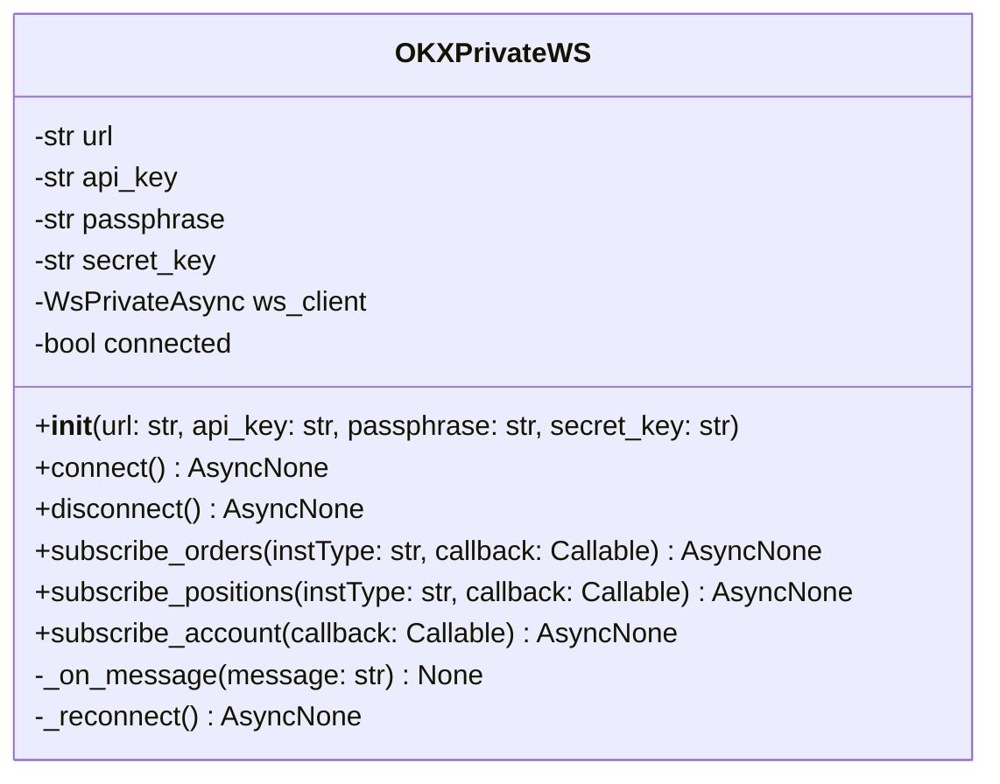
```mermaid
classDiagram
    class OKXPrivateWS {
        -str url
        -str api_key
        -str passphrase
        -str secret_key
        -WsPrivateAsync ws_client
        -bool connected
        +__init__(url: str, api_key: str, passphrase: str, secret_key: str)
        +connect() AsyncNone
        +disconnect() AsyncNone
        +subscribe_orders(instType: str, callback: Callable) AsyncNone
        +subscribe_positions(instType: str, callback: Callable) AsyncNone
        +subscribe_account(callback: Callable) AsyncNone
        -_on_message(message: str) None
        -_reconnect() AsyncNone
    }
```

```python
# trade/ws_private.py
from okx.websocket.WsPrivateAsync import WsPrivateAsync

class OKXPrivateWS:
    """
    OKX Private WebSocket สำหรับ real-time order/position/account updates.
    ใช้ Demo Trading URL: wss://wspap.okx.com:8443/ws/v5/private
    """

    async def connect(self) -> None:
        """Connect + authenticate with API credentials."""

    async def subscribe_orders(
        self, instType: str, callback: Callable[[dict], Awaitable[None]]
    ) -> None:
        """Subscribe {"channel": "orders", "instType": "SWAP"}"""

    async def subscribe_positions(
        self, instType: str, callback: Callable[[dict], Awaitable[None]]
    ) -> None:
        """Subscribe {"channel": "positions", "instType": "SWAP"}"""

    async def subscribe_account(
        self, callback: Callable[[dict], Awaitable[None]]
    ) -> None:
        """Subscribe {"channel": "account"}"""
```

---

### 4.11 Order Executor (`trade/order_executor.py`)

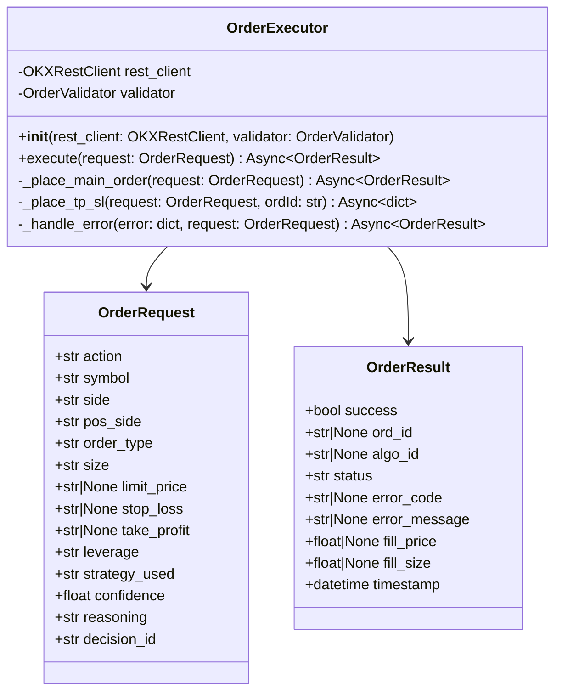
```mermaid
classDiagram
    class OrderExecutor {
        -OKXRestClient rest_client
        -OrderValidator validator
        +__init__(rest_client: OKXRestClient, validator: OrderValidator)
        +execute(request: OrderRequest) Async~OrderResult~
        -_place_main_order(request: OrderRequest) Async~OrderResult~
        -_place_tp_sl(request: OrderRequest, ordId: str) Async~dict~
        -_handle_error(error: dict, request: OrderRequest) Async~OrderResult~
    }

    class OrderRequest {
        +str action
        +str symbol
        +str side
        +str pos_side
        +str order_type
        +str size
        +str|None limit_price
        +str|None stop_loss
        +str|None take_profit
        +str leverage
        +str strategy_used
        +float confidence
        +str reasoning
        +str decision_id
    }

    class OrderResult {
        +bool success
        +str|None ord_id
        +str|None algo_id
        +str status
        +str|None error_code
        +str|None error_message
        +float|None fill_price
        +float|None fill_size
        +datetime timestamp
    }

    OrderExecutor --> OrderRequest
    OrderExecutor --> OrderResult
```

```python
# trade/order_executor.py

class OrderExecutor:
    def __init__(self, rest_client: OKXRestClient, validator: OrderValidator) -> None: ...

    async def execute(self, request: OrderRequest) -> OrderResult:
        """
        Full order execution flow:
        1. Validate via OrderValidator
        2. Place main order (market/limit)
        3. ถ้ามี SL/TP → place algo order
        4. Return OrderResult

        สำหรับ CLOSE action:
        - ใช้ close_position() แทน place_order()
        - Cancel existing algo orders for that position
        """

    async def _place_main_order(self, request: OrderRequest) -> OrderResult:
        """
        Place the primary order:
        - Market: place_order(ordType='market')
        - Limit: place_order(ordType='limit', px=limit_price)

        Cross margin mode (tdMode='cross')
        posSide = 'long' | 'short' (Long/Short mode)
        """

    async def _place_tp_sl(self, request: OrderRequest, ord_id: str) -> dict:
        """
        Place conditional TP/SL algo order:
        - slTriggerPx: stop loss trigger price
        - slOrdPx: '-1' (market price on trigger)
        - tpTriggerPx: take profit trigger price
        - tpOrdPx: '-1' (market price on trigger)
        """

    async def _handle_error(self, error: dict, request: OrderRequest) -> OrderResult:
        """Handle OKX API error: parse sCode, sMsg, retry if applicable."""
```

---

### 4.12 Position Manager (`trade/position_manager.py`)

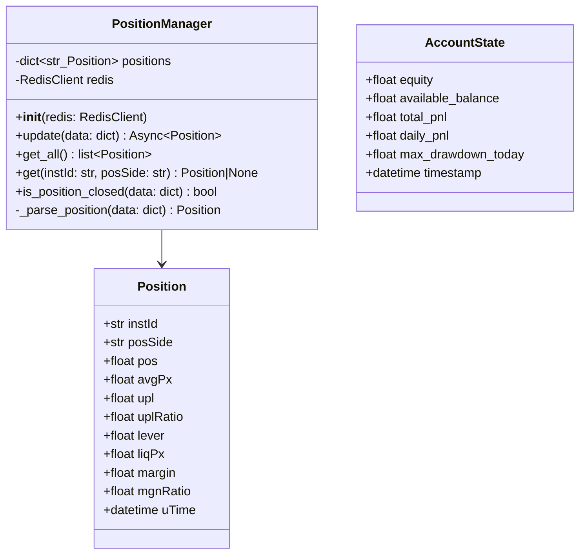
```mermaid
classDiagram
    class PositionManager {
        -dict~str_Position~ positions
        -RedisClient redis
        +__init__(redis: RedisClient)
        +update(data: dict) Async~Position~
        +get_all() list~Position~
        +get(instId: str, posSide: str) Position|None
        +is_position_closed(data: dict) bool
        -_parse_position(data: dict) Position
    }

    class Position {
        +str instId
        +str posSide
        +float pos
        +float avgPx
        +float upl
        +float uplRatio
        +float lever
        +float liqPx
        +float margin
        +float mgnRatio
        +datetime uTime
    }

    class AccountState {
        +float equity
        +float available_balance
        +float total_pnl
        +float daily_pnl
        +float max_drawdown_today
        +datetime timestamp
    }

    PositionManager --> Position
```

```python
# trade/position_manager.py

class PositionManager:
    """
    Track open positions in memory, updated via OKX Private WebSocket.
    Publish changes to Redis "trade:positions".
    """

    async def update(self, data: dict) -> Position:
        """
        Parse OKX position update, update internal state.
        Detect if position closed (pos == '0').
        Publish to Redis.
        """

    def get_all(self) -> list[Position]:
        """Get all current positions."""

    def get(self, instId: str, posSide: str) -> Position | None:
        """Get specific position by instrument and side."""

    def is_position_closed(self, data: dict) -> bool:
        """Check if position update indicates close (pos == '0')."""
```

---

### 4.13 Order Validator (`trade/order_validator.py`)

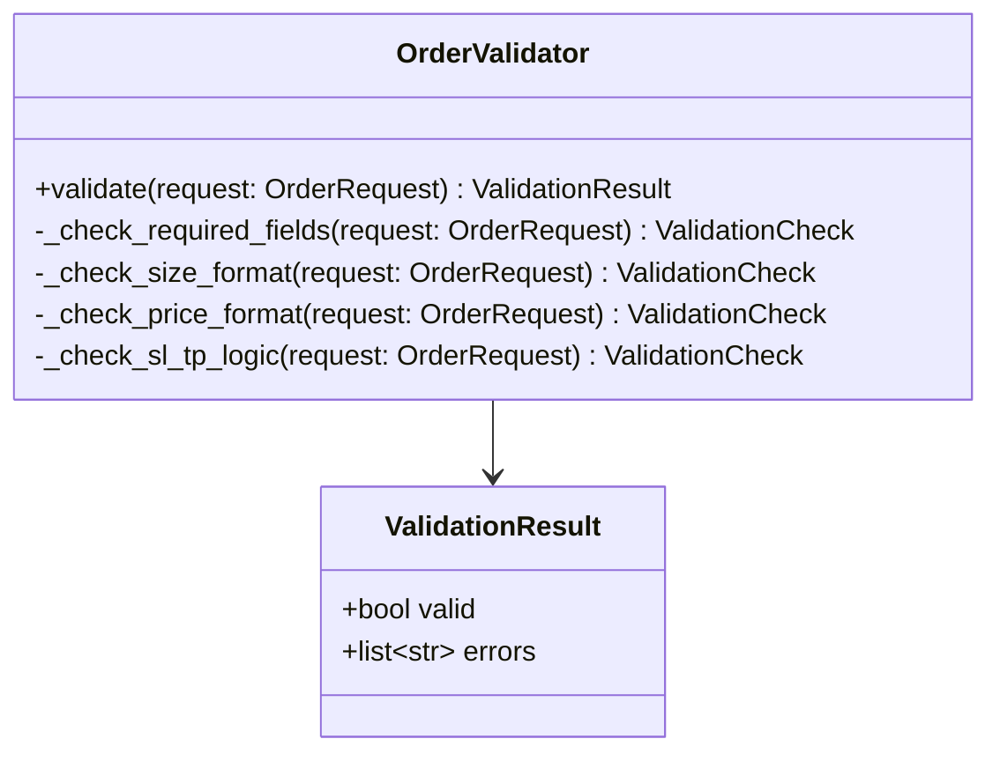
```mermaid
classDiagram
    class OrderValidator {
        +validate(request: OrderRequest) ValidationResult
        -_check_required_fields(request: OrderRequest) ValidationCheck
        -_check_size_format(request: OrderRequest) ValidationCheck
        -_check_price_format(request: OrderRequest) ValidationCheck
        -_check_sl_tp_logic(request: OrderRequest) ValidationCheck
    }

    class ValidationResult {
        +bool valid
        +list~str~ errors
    }

    OrderValidator --> ValidationResult
```

```python
# trade/order_validator.py

class OrderValidator:
    """
    Pre-execution validation (technical validation, ไม่ใช่ risk management):
    - Required fields present
    - Size > 0 and valid format
    - Limit price valid for limit orders
    - SL < entry for LONG, SL > entry for SHORT
    - TP > entry for LONG, TP < entry for SHORT
    """

    def validate(self, request: OrderRequest) -> ValidationResult:
        """Run all validation checks. Returns ValidationResult."""
```

---

## 5. Sequence Diagrams

### 5.1 Market Data Collection Pipeline

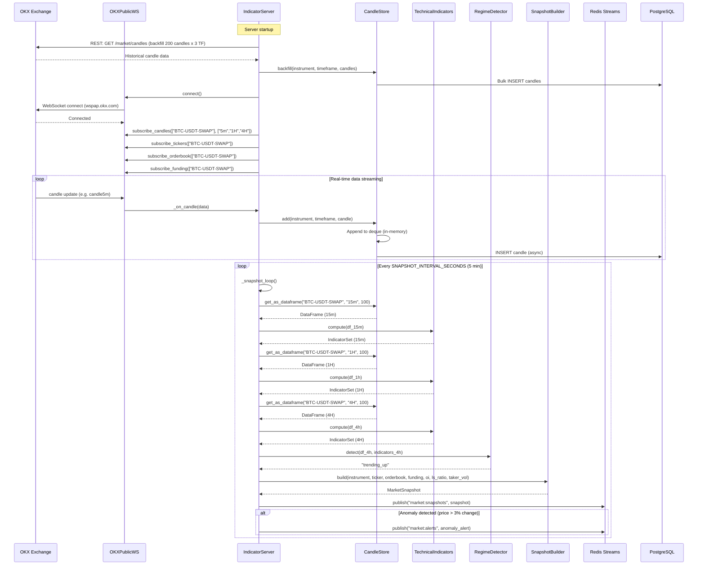
```mermaid
sequenceDiagram
    participant OKX as OKX Exchange
    participant WS as OKXPublicWS
    participant IS as IndicatorServer
    participant CS as CandleStore
    participant TI as TechnicalIndicators
    participant RD as RegimeDetector
    participant SB as SnapshotBuilder
    participant Redis as Redis Streams
    participant DB as PostgreSQL

    Note over IS: Server startup
    IS->>OKX: REST: GET /market/candles (backfill 200 candles x 3 TF)
    OKX-->>IS: Historical candle data
    IS->>CS: backfill(instrument, timeframe, candles)
    CS->>DB: Bulk INSERT candles

    IS->>WS: connect()
    WS->>OKX: WebSocket connect (wspap.okx.com)
    OKX-->>WS: Connected

    IS->>WS: subscribe_candles(["BTC-USDT-SWAP"], ["5m","1H","4H"])
    IS->>WS: subscribe_tickers(["BTC-USDT-SWAP"])
    IS->>WS: subscribe_orderbook(["BTC-USDT-SWAP"])
    IS->>WS: subscribe_funding(["BTC-USDT-SWAP"])

    loop Real-time data streaming
        OKX->>WS: candle update (e.g. candle5m)
        WS->>IS: _on_candle(data)
        IS->>CS: add(instrument, timeframe, candle)
        CS->>CS: Append to deque (in-memory)
        CS->>DB: INSERT candle (async)
    end

    loop Every SNAPSHOT_INTERVAL_SECONDS (5 min)
        IS->>IS: _snapshot_loop()
        IS->>CS: get_as_dataframe("BTC-USDT-SWAP", "15m", 100)
        CS-->>IS: DataFrame (15m)
        IS->>TI: compute(df_15m)
        TI-->>IS: IndicatorSet (15m)

        IS->>CS: get_as_dataframe("BTC-USDT-SWAP", "1H", 100)
        CS-->>IS: DataFrame (1H)
        IS->>TI: compute(df_1h)
        TI-->>IS: IndicatorSet (1H)

        IS->>CS: get_as_dataframe("BTC-USDT-SWAP", "4H", 100)
        CS-->>IS: DataFrame (4H)
        IS->>TI: compute(df_4h)
        TI-->>IS: IndicatorSet (4H)

        IS->>RD: detect(df_4h, indicators_4h)
        RD-->>IS: "trending_up"

        IS->>SB: build(instrument, ticker, orderbook, funding, oi, ls_ratio, taker_vol)
        SB-->>IS: MarketSnapshot

        IS->>Redis: publish("market:snapshots", snapshot)

        alt Anomaly detected (price > 3% change)
            IS->>Redis: publish("market:alerts", anomaly_alert)
        end
    end
```

### 5.2 Order Execution Flow

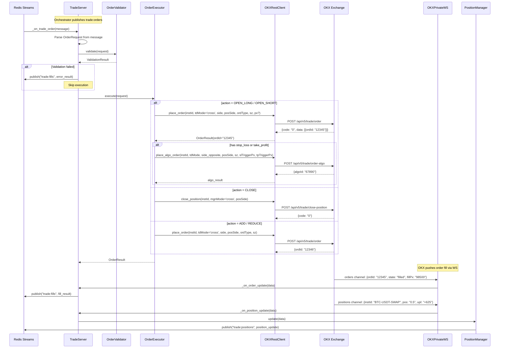
```mermaid
sequenceDiagram
    participant Redis as Redis Streams
    participant TS as TradeServer
    participant OV as OrderValidator
    participant OE as OrderExecutor
    participant REST as OKXRestClient
    participant OKX as OKX Exchange
    participant WS as OKXPrivateWS
    participant PM as PositionManager

    Note over TS: Orchestrator publishes trade:orders
    Redis->>TS: _on_trade_order(message)
    TS->>TS: Parse OrderRequest from message

    TS->>OV: validate(request)
    OV-->>TS: ValidationResult

    alt Validation failed
        TS->>Redis: publish("trade:fills", error_result)
        Note over TS: Skip execution
    end

    TS->>OE: execute(request)

    alt action = OPEN_LONG / OPEN_SHORT
        OE->>REST: place_order(instId, tdMode='cross', side, posSide, ordType, sz, px?)
        REST->>OKX: POST /api/v5/trade/order
        OKX-->>REST: {code: "0", data: [{ordId: "12345"}]}
        REST-->>OE: OrderResult(ordId="12345")

        alt has stop_loss or take_profit
            OE->>REST: place_algo_order(instId, tdMode, side_opposite, posSide, sz, slTriggerPx, tpTriggerPx)
            REST->>OKX: POST /api/v5/trade/order-algo
            OKX-->>REST: {algoId: "67890"}
            REST-->>OE: algo_result
        end
    else action = CLOSE
        OE->>REST: close_position(instId, mgnMode='cross', posSide)
        REST->>OKX: POST /api/v5/trade/close-position
        OKX-->>REST: {code: "0"}
    else action = ADD / REDUCE
        OE->>REST: place_order(instId, tdMode='cross', side, posSide, ordType, sz)
        REST->>OKX: POST /api/v5/trade/order
        OKX-->>REST: {ordId: "12346"}
    end

    OE-->>TS: OrderResult

    Note over WS: OKX pushes order fill via WS

    OKX->>WS: orders channel: {ordId: "12345", state: "filled", fillPx: "98500"}
    WS->>TS: _on_order_update(data)
    TS->>Redis: publish("trade:fills", fill_result)

    OKX->>WS: positions channel: {instId: "BTC-USDT-SWAP", pos: "0.5", upl: "+625"}
    WS->>TS: _on_position_update(data)
    TS->>PM: update(data)
    PM->>Redis: publish("trade:positions", position_update)
```

### 5.3 Position Lifecycle

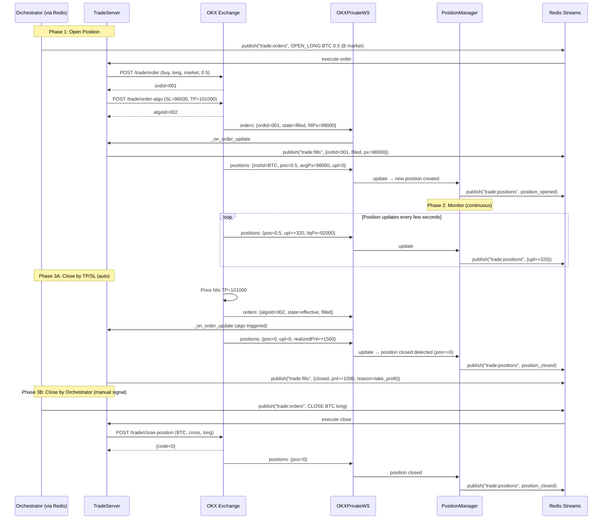
```mermaid
sequenceDiagram
    participant Orch as Orchestrator (via Redis)
    participant TS as TradeServer
    participant OKX as OKX Exchange
    participant WS as OKXPrivateWS
    participant PM as PositionManager
    participant Redis as Redis Streams

    Note over Orch,TS: Phase 1: Open Position
    Orch->>Redis: publish("trade:orders", OPEN_LONG BTC 0.5 @ market)
    Redis->>TS: execute order
    TS->>OKX: POST /trade/order (buy, long, market, 0.5)
    OKX-->>TS: ordId=001
    TS->>OKX: POST /trade/order-algo (SL=96500, TP=101000)
    OKX-->>TS: algoId=002

    OKX->>WS: orders: {ordId=001, state=filled, fillPx=98000}
    WS->>TS: _on_order_update
    TS->>Redis: publish("trade:fills", {ordId=001, filled, px=98000})

    OKX->>WS: positions: {instId=BTC, pos=0.5, avgPx=98000, upl=0}
    WS->>PM: update → new position created
    PM->>Redis: publish("trade:positions", position_opened)

    Note over PM: Phase 2: Monitor (continuous)
    loop Position updates every few seconds
        OKX->>WS: positions: {pos=0.5, upl=+320, liqPx=92000}
        WS->>PM: update
        PM->>Redis: publish("trade:positions", {upl=+320})
    end

    Note over Orch,TS: Phase 3A: Close by TP/SL (auto)
    OKX->>OKX: Price hits TP=101000
    OKX->>WS: orders: {algoId=002, state=effective, filled}
    WS->>TS: _on_order_update (algo triggered)

    OKX->>WS: positions: {pos=0, upl=0, realizedPnl=+1500}
    WS->>PM: update → position closed detected (pos==0)
    PM->>Redis: publish("trade:positions", position_closed)
    TS->>Redis: publish("trade:fills", {closed, pnl=+1500, reason=take_profit})

    Note over Orch,TS: Phase 3B: Close by Orchestrator (manual signal)
    Orch->>Redis: publish("trade:orders", CLOSE BTC long)
    Redis->>TS: execute close
    TS->>OKX: POST /trade/close-position (BTC, cross, long)
    OKX-->>TS: {code=0}

    OKX->>WS: positions: {pos=0}
    WS->>PM: position closed
    PM->>Redis: publish("trade:positions", position_closed)
```

---

## 6. Redis Message Schemas

### 6.1 Indicator Server Publishes

#### `market:snapshots` — Full market snapshot

```json
{
  "msg_id": "uuid-v4",
  "timestamp": "2026-02-07T10:30:00Z",
  "source": "indicator_server",
  "type": "market_snapshot",
  "payload": {
    "instrument": "BTC-USDT-SWAP",
    "ticker": {
      "symbol": "BTC-USDT-SWAP",
      "last": 98450.2,
      "bid": 98448.0,
      "ask": 98452.5,
      "volume_24h": 125000000.0,
      "change_24h": 2.3,
      "volume_ratio": 1.2
    },
    "indicators": {
      "15m": {
        "rsi": 72.3,
        "macd": {"line": 125.3, "signal": 98.7, "histogram": 26.6},
        "bollinger": {"upper": 99100, "middle": 97800, "lower": 96500},
        "ema": {"20": 97950, "50": 96800, "200": 94200},
        "atr": 850.5,
        "vwap": 97600.0,
        "adx": 32.5,
        "stoch_rsi": {"k": 85.2, "d": 78.6},
        "obv": 15234567.0,
        "ichimoku": {"tenkan": 98100, "kijun": 97500, "senkou_a": 97800, "senkou_b": 96900, "chikou": 97200},
        "support_levels": [97200, 96500, 95000],
        "resistance_levels": [99000, 100000, 101500],
        "volume_ratio": 1.2,
        "bb_position": "upper_half",
        "ema_alignment": "bullish",
        "macd_signal": "bullish"
      },
      "1H": { "...same structure..." },
      "4H": { "...same structure..." }
    },
    "orderbook": {
      "bids": [[98448.0, 12.5], [98445.0, 8.3]],
      "asks": [[98452.5, 10.1], [98455.0, 15.7]],
      "spread": 4.5,
      "bid_depth": 125.3,
      "ask_depth": 118.7
    },
    "funding_rate": {
      "current": 0.0015,
      "predicted": 0.0012,
      "next_funding_time": "2026-02-07T16:00:00Z"
    },
    "open_interest": {
      "oi": 45000.5,
      "oi_change_24h": 5.2
    },
    "long_short_ratio": 1.42,
    "taker_buy_sell_ratio": 0.87,
    "market_regime": "trending_up",
    "price_change_1h": 1.2,
    "oi_change_4h": 3.5
  },
  "metadata": {
    "latency_ms": 45,
    "version": "1.0"
  }
}
```

#### `market:alerts` — Market anomaly alerts

```json
{
  "msg_id": "uuid-v4",
  "timestamp": "2026-02-07T10:30:00Z",
  "source": "indicator_server",
  "type": "market_alert",
  "payload": {
    "alert_type": "price_spike",
    "instrument": "BTC-USDT-SWAP",
    "detail": "Price moved +3.5% in last 1 hour",
    "current_price": 98450.2,
    "reference_price": 95120.0,
    "severity": "WARN"
  }
}
```

### 6.2 Trade Server Publishes

#### `trade:fills` — Order fill confirmations

```json
{
  "msg_id": "uuid-v4",
  "timestamp": "2026-02-07T10:30:15Z",
  "source": "trade_server",
  "type": "trade_fill",
  "payload": {
    "decision_id": "uuid-v4",
    "ord_id": "12345678",
    "algo_id": "87654321",
    "symbol": "BTC-USDT-SWAP",
    "side": "buy",
    "pos_side": "long",
    "order_type": "market",
    "fill_price": 98450.2,
    "fill_size": 0.5,
    "fee": -4.92,
    "status": "filled",
    "pnl": null,
    "exit_reason": null
  },
  "metadata": {
    "execution_latency_ms": 120
  }
}
```

#### `trade:positions` — Position updates

```json
{
  "msg_id": "uuid-v4",
  "timestamp": "2026-02-07T10:35:00Z",
  "source": "trade_server",
  "type": "position_update",
  "payload": {
    "event": "updated",
    "instId": "BTC-USDT-SWAP",
    "posSide": "long",
    "pos": "0.5",
    "avgPx": "98450.2",
    "upl": 625.0,
    "uplRatio": 0.013,
    "lever": "3",
    "liqPx": "92100.5",
    "margin": "16408.37",
    "mgnRatio": "0.15"
  }
}
```

Position closed event:
```json
{
  "msg_id": "uuid-v4",
  "timestamp": "2026-02-07T12:45:00Z",
  "source": "trade_server",
  "type": "position_update",
  "payload": {
    "event": "closed",
    "instId": "BTC-USDT-SWAP",
    "posSide": "long",
    "pos": "0",
    "avgPx": "98450.2",
    "exit_price": "101000.0",
    "realized_pnl": 1274.9,
    "exit_reason": "take_profit",
    "duration_seconds": 8100
  }
}
```

#### `trade:positions` — Account balance update

```json
{
  "msg_id": "uuid-v4",
  "timestamp": "2026-02-07T10:35:00Z",
  "source": "trade_server",
  "type": "account_update",
  "payload": {
    "equity": 102500.0,
    "available_balance": 89200.0,
    "total_pnl": 2500.0,
    "daily_pnl": 1200.0
  }
}
```

### 6.3 Trade Server Subscribes

| Stream | Message Type | Action |
|--------|-------------|--------|
| `trade:orders` | `trade_order` | Parse OrderRequest, execute on OKX |

---

## 7. Database Schema (Indicator-Trade Owned)

### 7.1 `candles` — TimescaleDB Hypertable

```sql
CREATE TABLE candles (
    time        TIMESTAMPTZ NOT NULL,
    symbol      VARCHAR(30) NOT NULL,
    timeframe   VARCHAR(5)  NOT NULL,   -- '5m', '1H', '4H', '1D'
    open        DECIMAL(20,8) NOT NULL,
    high        DECIMAL(20,8) NOT NULL,
    low         DECIMAL(20,8) NOT NULL,
    close       DECIMAL(20,8) NOT NULL,
    volume      DECIMAL(30,8) NOT NULL,

    PRIMARY KEY (time, symbol, timeframe)
);

-- Convert to TimescaleDB hypertable
SELECT create_hypertable('candles', 'time');

-- Indexes
CREATE INDEX idx_candles_symbol_tf ON candles (symbol, timeframe, time DESC);

-- Retention policy: keep 6 months of data
SELECT add_retention_policy('candles', INTERVAL '6 months');

-- Continuous aggregate for daily OHLCV (optional optimization)
CREATE MATERIALIZED VIEW candles_daily
WITH (timescaledb.continuous) AS
SELECT
    time_bucket('1 day', time) AS day,
    symbol,
    first(open, time) AS open,
    max(high) AS high,
    min(low) AS low,
    last(close, time) AS close,
    sum(volume) AS volume
FROM candles
WHERE timeframe = '1H'
GROUP BY day, symbol;
```

---

## 8. Dependencies

```toml
[project]
name = "indicator-trade-server"
version = "0.1.0"
requires-python = ">=3.12"
dependencies = [
    "python-okx>=5.3",
    "pandas>=2.0",
    "pandas-ta>=0.3.14b",
    "redis[hiredis]>=5.0",
    "sqlalchemy[asyncio]>=2.0",
    "asyncpg>=0.29",
    "pydantic>=2.0",
    "pydantic-settings>=2.0",
    "structlog>=24.0",
]
```
