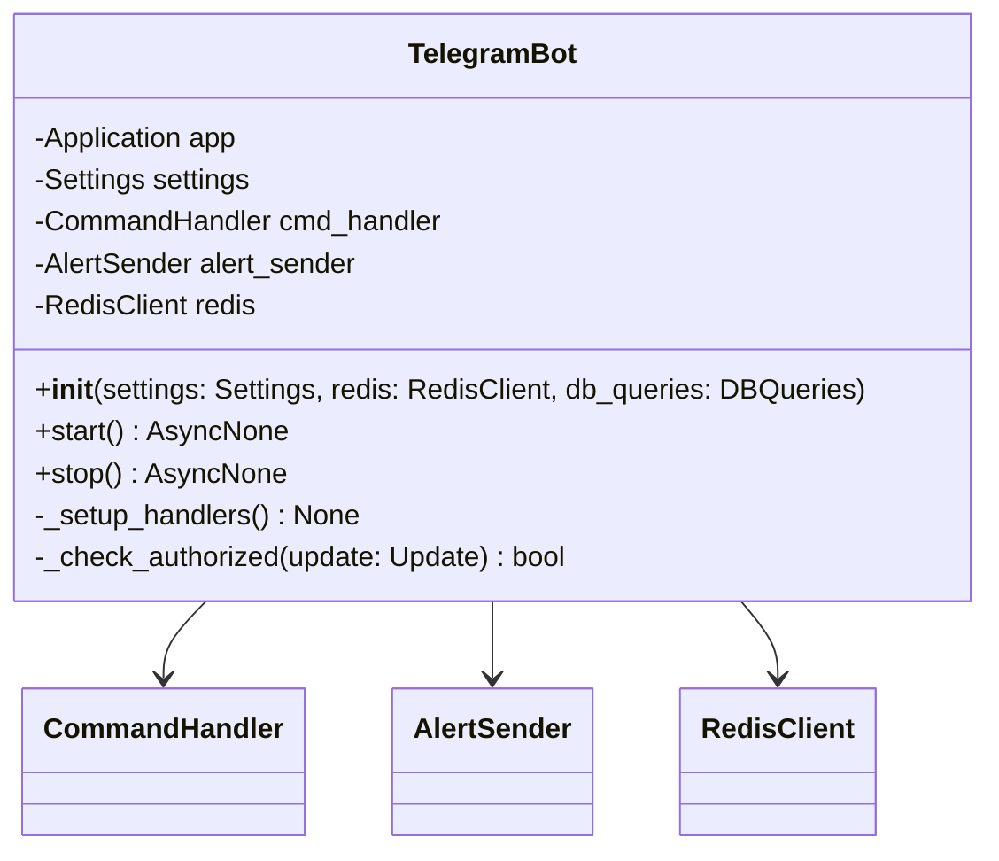
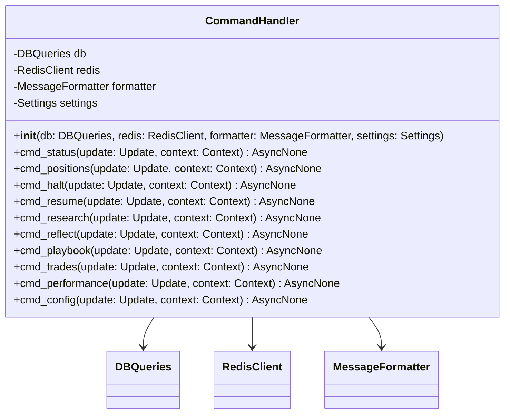
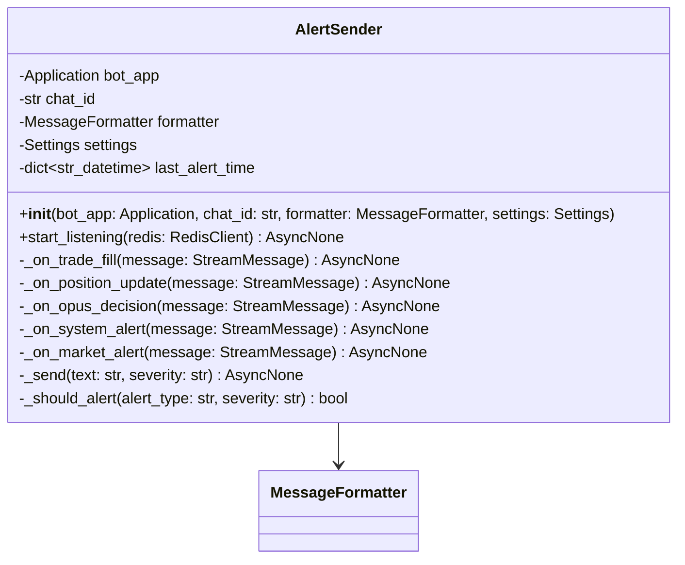
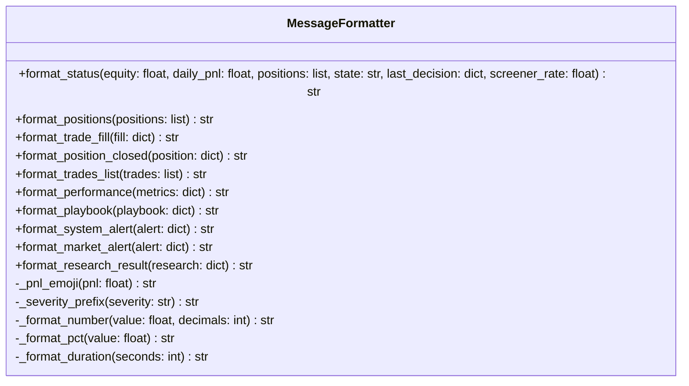
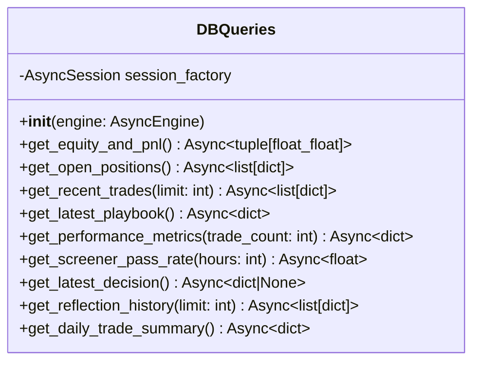
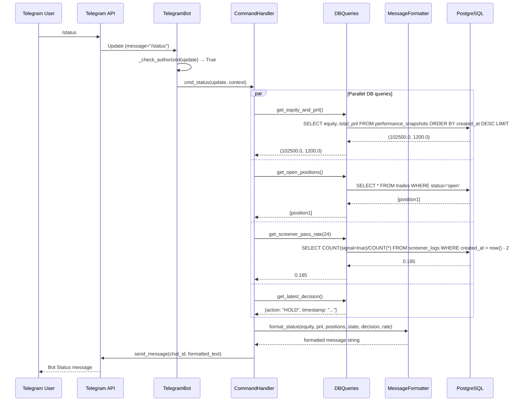
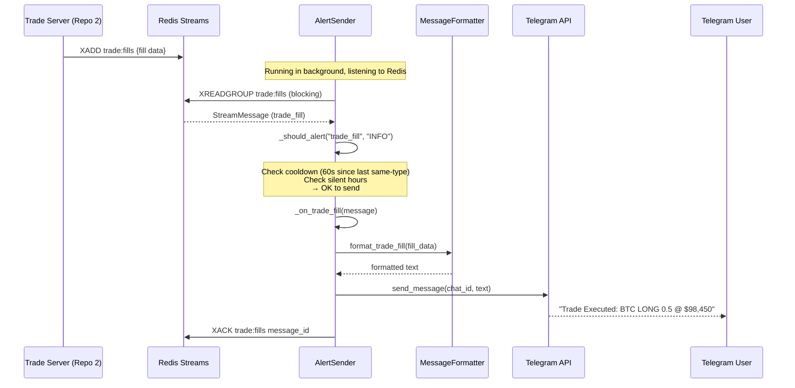
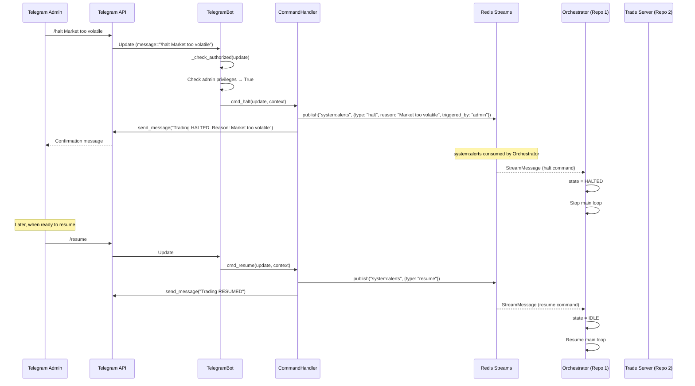
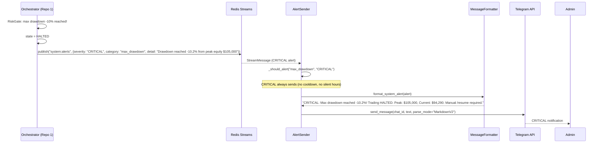

# System Design: UI (Telegram Bot + Grafana)

> Repo: `ui` | Python 3.12 + AsyncIO
> Version: 1.0 | February 2026

---

## 1. Overview

UI Repo ทำหน้าที่ Monitoring, Alerting, และ Human Interaction สำหรับ Trading Bot:

**Telegram Bot:**
- รับคำสั่งจากผู้ดูแล (/status, /halt, /positions, etc.)
- ส่ง auto-alerts (trade executed, risk triggered, system errors)
- เป็น human override channel (halt/resume trading)

**Grafana Dashboards:**
- 7 pre-configured dashboards
- อ่านข้อมูลจาก PostgreSQL (read-only)
- Auto-provisioned via Docker volume

### Component Diagram

```
┌─────────────────────────────────────────────────────────────────────┐
│                              UI                                      │
│                                                                      │
│  ┌──────────────────────────────────┐  ┌──────────────────────────┐  │
│  │        TELEGRAM BOT              │  │     GRAFANA              │  │
│  │                                  │  │                          │  │
│  │  ┌──────────┐ ┌──────────────┐  │  │  ┌────────────────────┐  │  │
│  │  │ Bot      │ │ Command      │  │  │  │ 7 Dashboards       │  │  │
│  │  │ Handler  │ │ Handler      │  │  │  │ (JSON provisioned) │  │  │
│  │  └──────────┘ └──────────────┘  │  │  └────────────────────┘  │  │
│  │                                  │  │                          │  │
│  │  ┌──────────┐ ┌──────────────┐  │  │  ┌────────────────────┐  │  │
│  │  │ Alert    │ │ Message      │  │  │  │ PostgreSQL         │  │  │
│  │  │ Sender   │ │ Formatter    │  │  │  │ Datasource         │  │  │
│  │  └──────────┘ └──────────────┘  │  │  └────────────────────┘  │  │
│  └────────────────┬─────────────────┘  └──────────────────────────┘  │
│                   │                                                   │
│  ┌────────────────▼──────────────────────────────────────────────┐   │
│  │                     Redis Client                               │   │
│  │  subscribe: trade:fills, trade:positions, opus:decisions,     │   │
│  │             system:alerts, market:alerts                       │   │
│  │  publish: trade:orders (for /halt, /resume commands)          │   │
│  │           system:alerts (for manual triggers)                  │   │
│  └───────────────────────────────────────────────────────────────┘   │
│                                                                      │
│  ┌───────────────────────────────────────────────────────────────┐   │
│  │                     DB Client (Read-Only)                      │   │
│  │  Read: trades, playbook_versions, performance_snapshots,      │   │
│  │        reflection_logs, screener_logs                          │   │
│  └───────────────────────────────────────────────────────────────┘   │
└─────────────────────────────────────────────────────────────────────┘
```

---

## 2. Directory Structure

```
ui/
├── Dockerfile
├── pyproject.toml
├── src/
│   └── ui/
│       ├── __init__.py
│       ├── main.py                        # Entry point: start bot + alert listener
│       ├── config.py                      # Telegram token, DB, Redis settings
│       │
│       ├── telegram/
│       │   ├── __init__.py
│       │   ├── bot.py                     # Application builder + handlers setup
│       │   ├── commands.py                # All /command handlers
│       │   ├── alerts.py                  # Auto-alert sender (Redis subscriber)
│       │   └── formatters.py              # Message formatting (Markdown)
│       │
│       ├── models/
│       │   ├── __init__.py
│       │   └── messages.py                # Redis Stream message schemas
│       │
│       ├── db/
│       │   ├── __init__.py
│       │   ├── engine.py                  # AsyncEngine (read-only connection)
│       │   └── queries.py                 # Read-only query functions
│       │
│       └── redis_client.py                # Redis Streams subscribe + publish
│
├── grafana/
│   ├── provisioning/
│   │   ├── dashboards/
│   │   │   └── dashboard.yml             # Auto-load dashboard configs
│   │   └── datasources/
│   │       └── datasource.yml            # PostgreSQL datasource
│   └── dashboards/
│       ├── portfolio_overview.json        # Equity curve, daily PnL, drawdown
│       ├── active_positions.json          # Open trades, unrealized PnL
│       ├── strategy_performance.json      # Win rate, avg RR per strategy
│       ├── opus_activity.json             # Decisions/hr, confidence, API cost
│       ├── risk_monitor.json              # Daily loss, exposure, consecutive losses
│       ├── system_health.json             # API uptime, WS status, Redis lag
│       └── playbook_evolution.json        # Version history, lessons, calibration
│
└── tests/
    ├── conftest.py
    ├── test_commands.py
    ├── test_formatters.py
    └── test_alerts.py
```

---

## 3. Class Diagrams + Method Signatures

### 3.1 Config (`config.py`)

```python
# config.py
from pydantic_settings import BaseSettings

class Settings(BaseSettings):
    # --- Telegram ---
    TELEGRAM_BOT_TOKEN: str
    TELEGRAM_CHAT_ID: str                    # Authorized chat ID
    TELEGRAM_ADMIN_IDS: list[int] = []       # Admin user IDs for /halt /resume

    # --- Infrastructure ---
    DATABASE_URL: str
    REDIS_URL: str = "redis://redis:6379"

    # --- Alert Settings ---
    ALERT_ON_TRADE: bool = True
    ALERT_ON_REFLECTION: bool = True
    ALERT_ON_RISK_REJECTION: bool = True
    ALERT_COOLDOWN_SECONDS: int = 60         # Min gap between same-type alerts
    SILENT_HOURS_UTC: list[int] = []         # Hours to suppress INFO alerts

    model_config = {"env_prefix": "", "case_sensitive": True}
```

---

### 3.2 Telegram Bot (`telegram/bot.py`)



```python
# telegram/bot.py
from telegram.ext import Application, CommandHandler as TGCommandHandler

class TelegramBot:
    def __init__(
        self,
        settings: Settings,
        redis: RedisClient,
        db_queries: DBQueries,
    ) -> None: ...

    async def start(self) -> None:
        """
        1. Build Application with bot token
        2. Register command handlers
        3. Start alert listener (Redis subscriber)
        4. Start polling for Telegram updates
        """

    async def stop(self) -> None:
        """Gracefully stop bot + alert listener."""

    def _setup_handlers(self) -> None:
        """
        Register all command handlers:
        /status, /positions, /halt, /resume, /research,
        /reflect, /playbook, /trades, /performance, /config
        """

    def _check_authorized(self, update) -> bool:
        """
        Check if message comes from authorized chat_id.
        Admin commands (/halt, /resume, /config) require admin_ids.
        """
```

---

### 3.3 Command Handler (`telegram/commands.py`)



```python
# telegram/commands.py

class CommandHandler:
    def __init__(
        self,
        db: DBQueries,
        redis: RedisClient,
        formatter: MessageFormatter,
        settings: Settings,
    ) -> None: ...

    async def cmd_status(self, update, context) -> None:
        """
        /status
        แสดง:
        - Current equity + daily PnL (% + USD)
        - Open positions count + total unrealized PnL
        - Bot state (IDLE/ANALYZING/HALTED/COOLDOWN)
        - Last decision time + action
        - Screener pass rate (24h)

        Query: trades (open), performance_snapshots (latest daily)
        """

    async def cmd_positions(self, update, context) -> None:
        """
        /positions
        แสดง detailed open positions:
        - Symbol, direction, size
        - Entry price, current price, unrealized PnL
        - SL, TP, distance to SL/TP (%)
        - Duration, strategy used

        Query: trades WHERE status='open'
        """

    async def cmd_halt(self, update, context) -> None:
        """
        /halt [reason]
        Emergency halt all trading.
        Requires admin privileges.

        Action:
        1. Publish system:alerts {type: "halt", reason}
        2. Reply confirmation
        """

    async def cmd_resume(self, update, context) -> None:
        """
        /resume
        Resume trading after halt.
        Requires admin privileges.

        Action:
        1. Publish system:alerts {type: "resume"}
        2. Reply confirmation
        """

    async def cmd_research(self, update, context) -> None:
        """
        /research [query]
        Manual trigger for Perplexity research.
        e.g. /research What is the impact of today's CPI data on BTC?

        Action:
        1. Publish system:alerts {type: "research_request", query}
        2. Reply "Research requested, will notify when complete"
        """

    async def cmd_reflect(self, update, context) -> None:
        """
        /reflect
        Force immediate deep reflection cycle.

        Action:
        1. Publish system:alerts {type: "force_reflect"}
        2. Reply confirmation
        """

    async def cmd_playbook(self, update, context) -> None:
        """
        /playbook
        View current playbook summary:
        - Version number + last updated
        - Active strategies + their win rates
        - Recent lessons (last 5)
        - Confidence calibration
        - Time filters

        Query: playbook_versions (latest)
        """

    async def cmd_trades(self, update, context) -> None:
        """
        /trades [n=10]
        Show last N trades:
        - Symbol, direction, PnL, duration
        - Strategy used, confidence
        - Win/loss indicator

        Query: trades ORDER BY closed_at DESC LIMIT n
        """

    async def cmd_performance(self, update, context) -> None:
        """
        /performance
        Show performance metrics:
        - Win rate, profit factor, Sharpe ratio
        - Total PnL, max drawdown
        - Best/worst trade
        - Breakdown by strategy
        - Breakdown by market regime

        Query: trades (all closed), performance_snapshots
        """

    async def cmd_config(self, update, context) -> None:
        """
        /config [key] [value]
        View or update configuration.
        Without args: show current config
        With args: update specific parameter

        e.g. /config DECISION_CYCLE_SECONDS 600
        Requires admin privileges for set.

        Action:
        1. Publish system:alerts {type: "config_update", key, value}
        2. Reply confirmation
        """
```

---

### 3.4 Alert Sender (`telegram/alerts.py`)



```python
# telegram/alerts.py

class AlertSender:
    """
    Listens to Redis Streams and sends Telegram notifications.

    Alert Routing:

    | Source Stream      | Condition                    | Severity | Action              |
    |--------------------|------------------------------|----------|---------------------|
    | trade:fills        | Trade executed               | INFO     | Send trade details  |
    | trade:positions    | Position closed              | INFO     | Send PnL summary    |
    | opus:decisions     | Decision made (optional)     | DEBUG    | Only if enabled     |
    | system:alerts      | Risk rejection               | WARN     | Send warning        |
    | system:alerts      | Consecutive losses >= 2      | WARN     | Send warning        |
    | system:alerts      | Playbook updated             | INFO     | Send summary        |
    | system:alerts      | Max drawdown reached         | CRITICAL | Send + mention      |
    | system:alerts      | System error / API down      | CRITICAL | Send + mention      |
    | system:alerts      | Daily loss limit hit         | CRITICAL | Send HALT notice    |
    | system:alerts      | Research completed           | INFO     | Send research brief |
    | market:alerts      | Price anomaly                | WARN     | Send alert          |
    """

    async def start_listening(self, redis: RedisClient) -> None:
        """
        Subscribe to multiple Redis streams:
        - trade:fills
        - trade:positions
        - opus:decisions
        - system:alerts
        - market:alerts

        Route messages to appropriate handlers.
        """

    async def _on_trade_fill(self, message: StreamMessage) -> None:
        """
        Format and send trade execution notification.
        Example message:
        ```
        Trade Executed
        BTC-USDT-SWAP LONG
        Size: 0.5 BTC @ $98,450
        SL: $96,500 (-2.0%)
        TP: $101,000 (+2.6%)
        Strategy: momentum_breakout
        Confidence: 78%
        ```
        """

    async def _on_position_update(self, message: StreamMessage) -> None:
        """
        Send notification when position closes.
        Example:
        ```
        Position Closed
        BTC-USDT-SWAP LONG
        Entry: $98,450 -> Exit: $101,000
        PnL: +$1,274.90 (+2.6%)
        Duration: 2h 15m
        Exit: Take Profit
        ```
        """

    async def _on_system_alert(self, message: StreamMessage) -> None:
        """
        Handle system alerts by severity:
        - INFO: Simple notification
        - WARN: Warning with details
        - CRITICAL: Urgent notification
        """

    def _should_alert(self, alert_type: str, severity: str) -> bool:
        """
        Check if alert should be sent:
        1. Cooldown period passed since last same-type alert
        2. Not in silent hours (for INFO level)
        3. CRITICAL always sends
        """

    async def _send(self, text: str, severity: str = "INFO") -> None:
        """Send formatted message to Telegram chat."""
```

---

### 3.5 Message Formatter (`telegram/formatters.py`)



```python
# telegram/formatters.py

class MessageFormatter:
    """
    Format messages for Telegram using Markdown V2.
    All methods return formatted strings ready to send.
    """

    def format_status(
        self,
        equity: float,
        daily_pnl: float,
        positions: list,
        state: str,
        last_decision: dict,
        screener_rate: float,
    ) -> str:
        """
        Format /status response:

        --- Bot Status ---
        State: IDLE
        Equity: $102,500.00
        Daily PnL: +$1,200.00 (+1.2%)
        Open Positions: 1
        Unrealized PnL: +$625.00

        Last Decision: HOLD (5 min ago)
        Screener Pass Rate: 18.5% (24h)
        """

    def format_positions(self, positions: list) -> str:
        """
        Format /positions response:

        --- Open Positions ---

        1. BTC-USDT-SWAP LONG
           Entry: $97,200 | Current: $98,450
           Size: 0.5 BTC (2.0% of equity)
           PnL: +$625.00 (+1.3%)
           SL: $96,500 (-0.7%) | TP: $101,000 (+2.6%)
           Duration: 3h 45m
           Strategy: pullback_entry
        """

    def format_trade_fill(self, fill: dict) -> str:
        """Format trade execution notification."""

    def format_position_closed(self, position: dict) -> str:
        """Format position close notification with PnL."""

    def format_trades_list(self, trades: list) -> str:
        """
        Format /trades response:

        --- Last 10 Trades ---
        1. WIN  BTC LONG  +$450 (+0.9%)  2h 15m  momentum
        2. LOSS BTC SHORT -$180 (-0.4%)  45m     mean_reversion
        3. WIN  ETH LONG  +$320 (+0.6%)  1h 30m  pullback
        ...
        Summary: 7W 3L (70%) | PF: 2.1 | Net: +$1,890
        """

    def format_performance(self, metrics: dict) -> str:
        """
        Format /performance response:

        --- Performance (Last 100 Trades) ---
        Win Rate: 62.0%
        Profit Factor: 1.88
        Sharpe Ratio: 1.42
        Total PnL: +$8,250
        Max Drawdown: -4.2%

        By Strategy:
          momentum_breakout: 62% WR, 1.9 RR (35 trades)
          pullback_entry: 57% WR, 1.5 RR (28 trades)
          mean_reversion: 60% WR, 1.2 RR (22 trades)

        By Regime:
          trending_up: 70% WR (40 trades)
          ranging: 55% WR (35 trades)
          volatile: 40% WR (10 trades)
        """

    def format_playbook(self, playbook: dict) -> str:
        """
        Format /playbook response:

        --- Playbook v47 ---
        Updated: 2026-02-07 10:00 UTC

        Active Strategies:
          momentum_breakout: 62% WR, 1.8 RR
          pullback_entry: 57% WR, 1.5 RR
          mean_reversion: 60% WR, 1.2 RR

        Recent Lessons:
          L001: Don't trade momentum in Asian session
          L002: Reduce size during volatile regime
          L003: RSI divergence reliable in ranging market

        Time Filters:
          Avoid: 00-03 UTC
          Prefer: 08-09, 13-16 UTC
        """

    def format_system_alert(self, alert: dict) -> str:
        """
        Format system alerts with severity prefix:
        INFO:     text
        WARN:     text
        CRITICAL: text
        """

    def format_research_result(self, research: dict) -> str:
        """
        Format Perplexity research result:

        --- Research Result ---
        Query: Impact of FOMC on BTC
        Sentiment: slightly_bearish
        Impact: HIGH | Horizon: immediate

        Key Points:
        - Fed expected to hold rates
        - Dot plot may signal fewer cuts

        Trading: Reduce long exposure before announcement
        Sources: Reuters, CME FedWatch
        """

    def _format_number(self, value: float, decimals: int = 2) -> str:
        """Format number with commas: 102500.00 → '102,500.00'"""

    def _format_pct(self, value: float) -> str:
        """Format percentage: 0.012 → '+1.2%'"""

    def _format_duration(self, seconds: int) -> str:
        """Format duration: 8100 → '2h 15m'"""
```

---

### 3.6 DB Queries (`db/queries.py`)



```python
# db/queries.py
from sqlalchemy.ext.asyncio import AsyncEngine, async_sessionmaker

class DBQueries:
    """
    Read-only query functions for Telegram bot commands.
    ไม่ write ข้อมูลเลย — อ่านอย่างเดียว.
    """

    def __init__(self, engine: AsyncEngine) -> None: ...

    async def get_equity_and_pnl(self) -> tuple[float, float]:
        """
        Query performance_snapshots for latest daily equity + PnL.
        Returns: (equity, daily_pnl)
        """

    async def get_open_positions(self) -> list[dict]:
        """
        Query trades WHERE status='open'.
        Returns: list of position dicts with entry_price, size, SL, TP, strategy, etc.
        """

    async def get_recent_trades(self, limit: int = 10) -> list[dict]:
        """
        Query trades WHERE status='closed' ORDER BY closed_at DESC LIMIT N.
        Returns: list of trade dicts with PnL, strategy, duration.
        """

    async def get_latest_playbook(self) -> dict:
        """
        Query playbook_versions ORDER BY version DESC LIMIT 1.
        Returns: playbook JSON dict.
        """

    async def get_performance_metrics(self, trade_count: int = 100) -> dict:
        """
        Compute metrics from last N closed trades:
        - win_rate, profit_factor, sharpe_ratio
        - total_pnl, max_drawdown
        - breakdown by strategy, regime
        Returns: metrics dict.
        """

    async def get_screener_pass_rate(self, hours: int = 24) -> float:
        """
        Query screener_logs for pass-through rate in last N hours.
        Returns: float (e.g. 0.185 = 18.5%)
        """

    async def get_latest_decision(self) -> dict | None:
        """
        Get most recent Opus decision from trades or a decisions cache.
        Returns: dict with action, time, confidence or None.
        """

    async def get_daily_trade_summary(self) -> dict:
        """
        Today's summary: trade count, wins, losses, PnL.
        """
```

---

### 3.7 Redis Client (`redis_client.py`)

```python
# redis_client.py

class RedisClient:
    """
    UI Redis client — mainly subscribes to streams for alerts.
    Also publishes system:alerts for /halt, /resume, /research commands.
    """

    def __init__(
        self,
        redis_url: str,
        consumer_group: str = "ui",
        consumer_name: str = "ui-1",
    ) -> None: ...

    async def subscribe_alerts(
        self,
        callback: Callable[[str, StreamMessage], Awaitable[None]],
    ) -> None:
        """
        Subscribe to multiple streams:
        - trade:fills
        - trade:positions
        - opus:decisions
        - system:alerts
        - market:alerts
        """

    async def publish_command(self, command_type: str, payload: dict) -> str:
        """
        Publish commands to system:alerts stream:
        - halt, resume, force_reflect, research_request, config_update
        """
```

---

## 4. Sequence Diagrams

### 4.1 User Command Flow (/status)



### 4.2 Auto-Alert Flow (Trade Executed)



### 4.3 Emergency Halt Flow



### 4.4 Critical Alert Flow (Max Drawdown)



---

## 5. Redis Subscriptions

| Stream | Consumer Group | Purpose |
|--------|---------------|---------|
| `trade:fills` | `ui` | ส่ง notification เมื่อ trade executed |
| `trade:positions` | `ui` | ส่ง notification เมื่อ position closed |
| `opus:decisions` | `ui` | (optional) log decisions for monitoring |
| `system:alerts` | `ui` | Forward alerts to Telegram (risk, halt, reflect, research) |
| `market:alerts` | `ui` | Forward market anomaly alerts |

### UI Publishes (สำหรับ commands)

| Stream | Message Type | Trigger |
|--------|-------------|---------|
| `system:alerts` | `halt` | /halt command |
| `system:alerts` | `resume` | /resume command |
| `system:alerts` | `force_reflect` | /reflect command |
| `system:alerts` | `research_request` | /research command |
| `system:alerts` | `config_update` | /config command |

---

## 6. Grafana Dashboard Specifications

### 6.1 Datasource Configuration

```yaml
# grafana/provisioning/datasources/datasource.yml
apiVersion: 1
datasources:
  - name: TradingBot-PostgreSQL
    type: postgres
    url: postgres:5432
    database: trading_bot
    user: grafana_reader    # Read-only user
    secureJsonData:
      password: ${GRAFANA_DB_PASSWORD}
    jsonData:
      sslmode: disable
      maxOpenConns: 5
      maxIdleConns: 5
      connMaxLifetime: 14400
      postgresVersion: 1600
      timescaledb: true
```

### 6.2 Dashboard Provisioning

```yaml
# grafana/provisioning/dashboards/dashboard.yml
apiVersion: 1
providers:
  - name: TradingBot
    orgId: 1
    folder: Trading Bot
    type: file
    disableDeletion: false
    editable: true
    options:
      path: /var/lib/grafana/dashboards
      foldersFromFilesStructure: false
```

### 6.3 Dashboard Details

#### 1. Portfolio Overview (`portfolio_overview.json`)

| Panel | Type | Query Source | Description |
|-------|------|-------------|-------------|
| Equity Curve | Time series | `performance_snapshots` | equity over time |
| Daily PnL Bar | Bar chart | `performance_snapshots` | daily PnL bars (green/red) |
| Drawdown Chart | Time series | `performance_snapshots` | drawdown % from peak |
| Sharpe Ratio | Stat | `performance_snapshots` | current rolling 30d Sharpe |
| Total PnL | Stat | `performance_snapshots` | total PnL since inception |
| Win Rate | Gauge | `trades` | current win rate % |

```sql
-- Example: Equity Curve
SELECT created_at AS time, equity
FROM performance_snapshots
WHERE snapshot_type = 'daily'
ORDER BY created_at;

-- Example: Daily PnL
SELECT
  date_trunc('day', closed_at) AS time,
  SUM(pnl_usd) AS daily_pnl
FROM trades
WHERE status = 'closed'
GROUP BY 1
ORDER BY 1;
```

#### 2. Active Positions (`active_positions.json`)

| Panel | Type | Query Source | Description |
|-------|------|-------------|-------------|
| Open Positions Table | Table | `trades` | symbol, direction, entry, PnL, SL, TP |
| Unrealized PnL | Stat | `trades` | sum of unrealized PnL |
| Distance to SL/TP | Bar gauge | `trades` | % distance to SL and TP |

```sql
-- Open positions
SELECT symbol, direction, entry_price, size,
       stop_loss, take_profit, strategy_used,
       opened_at, confidence_at_entry
FROM trades
WHERE status = 'open';
```

#### 3. Strategy Performance (`strategy_performance.json`)

| Panel | Type | Query Source | Description |
|-------|------|-------------|-------------|
| Win Rate by Strategy | Bar chart | `trades` | win rate per strategy |
| PnL by Strategy | Bar chart | `trades` | total PnL per strategy |
| Avg R:R by Strategy | Bar chart | `trades` | average reward:risk ratio |
| Trade Count by Strategy | Pie chart | `trades` | distribution |

```sql
-- Win rate by strategy
SELECT strategy_used,
       COUNT(*) AS total,
       COUNT(*) FILTER (WHERE pnl_usd > 0) * 100.0 / COUNT(*) AS win_rate,
       AVG(CASE WHEN pnl_usd > 0 THEN pnl_usd END) AS avg_win,
       AVG(CASE WHEN pnl_usd < 0 THEN pnl_usd END) AS avg_loss
FROM trades
WHERE status = 'closed' AND strategy_used IS NOT NULL
GROUP BY strategy_used;
```

#### 4. Opus Activity (`opus_activity.json`)

| Panel | Type | Query Source | Description |
|-------|------|-------------|-------------|
| Decisions/Hour | Time series | `screener_logs` | Opus calls per hour |
| Avg Confidence | Stat | `trades` | average confidence_at_entry |
| Screener Pass Rate | Time series | `screener_logs` | daily pass-through rate |
| API Latency | Time series | `screener_logs` | Haiku + Opus latency |
| Cost Estimate | Stat | `screener_logs` | estimated API cost (tokens * rate) |

```sql
-- Screener pass rate (daily)
SELECT
  date_trunc('day', created_at) AS day,
  COUNT(*) FILTER (WHERE signal) * 100.0 / COUNT(*) AS pass_rate
FROM screener_logs
GROUP BY 1
ORDER BY 1;
```

#### 5. Risk Monitor (`risk_monitor.json`)

| Panel | Type | Query Source | Description |
|-------|------|-------------|-------------|
| Daily Loss % | Gauge | `performance_snapshots` | current daily loss vs -3% limit |
| Max Drawdown | Gauge | `performance_snapshots` | current DD vs -10% limit |
| Exposure | Gauge | `trades` | current exposure vs 15% limit |
| Consecutive Losses | Stat | `trades` | current streak |
| Risk Rejections | Time series | `risk_rejections` | rejections over time |
| Rejection Reasons | Pie chart | `risk_rejections` | breakdown by rule |

```sql
-- Risk rejections over time
SELECT
  date_trunc('hour', created_at) AS time,
  COUNT(*) AS rejections
FROM risk_rejections
GROUP BY 1
ORDER BY 1;
```

#### 6. System Health (`system_health.json`)

| Panel | Type | Query Source | Description |
|-------|------|-------------|-------------|
| Bot State | Stat | Redis / custom | IDLE/ANALYZING/HALTED |
| Last Heartbeat | Stat | Redis / custom | time since last cycle |
| Screener Logs/Hour | Time series | `screener_logs` | throughput |
| DB Size | Stat | pg_database_size | database size |
| Candle Count | Stat | `candles` | total candles stored |

#### 7. Playbook Evolution (`playbook_evolution.json`)

| Panel | Type | Query Source | Description |
|-------|------|-------------|-------------|
| Version Timeline | Time series | `playbook_versions` | version number over time |
| Lesson Count | Stat | `playbook_versions` | total lessons in current playbook |
| Change Log | Table | `playbook_versions` | version, change_summary, triggered_by |
| Confidence Calibration | Table | `playbook_versions` | stated vs actual win rate |
| Reflection History | Table | `reflection_logs` | type, trades analyzed, summary |

```sql
-- Playbook version timeline
SELECT created_at AS time, version,
       change_summary, triggered_by
FROM playbook_versions
ORDER BY version;

-- Latest playbook lessons
SELECT
  playbook_json->'lessons_learned' AS lessons,
  playbook_json->'confidence_calibration' AS calibration
FROM playbook_versions
ORDER BY version DESC
LIMIT 1;
```

---

## 7. Telegram Commands Reference

| Command | Args | Auth | Description |
|---------|------|------|-------------|
| `/status` | — | user | Equity, PnL, positions count, bot state |
| `/positions` | — | user | Detailed open positions |
| `/trades` | `[n=10]` | user | Last N closed trades |
| `/performance` | — | user | Win rate, Sharpe, PnL, breakdowns |
| `/playbook` | — | user | Current playbook summary |
| `/halt` | `[reason]` | **admin** | Emergency halt all trading |
| `/resume` | — | **admin** | Resume after halt |
| `/research` | `[query]` | user | Trigger Perplexity research |
| `/reflect` | — | user | Force deep reflection cycle |
| `/config` | `[key] [val]` | **admin** (set) / user (view) | View/update config |

---

## 8. Dependencies

```toml
[project]
name = "ui"
version = "0.1.0"
requires-python = ">=3.12"
dependencies = [
    "python-telegram-bot>=21.0",
    "redis[hiredis]>=5.0",
    "sqlalchemy[asyncio]>=2.0",
    "asyncpg>=0.29",
    "pydantic>=2.0",
    "pydantic-settings>=2.0",
    "structlog>=24.0",
]
```
